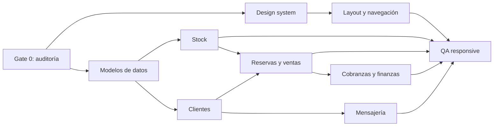

# Plan de implementación para Antigravity

## Gate 0 - Descubrimiento obligatorio

Objetivo: convertir los pendientes de evidencia en un mapa real de AutoSporting.

Entregables:

- Árbol relevante del repositorio.
- Tabla ruta -> página -> layout -> rol.
- Tabla entidad -> schema -> servicio -> consumidores.
- Inventario de componentes reutilizables.
- Lista de tests y comandos rápidos.
- Capturas desktop/mobile del estado inicial.

No implementar hasta cerrar este gate.

## Etapa 1 - Cambios visuales globales

Objetivo:

- Definir tokens semánticos.
- Normalizar tipografía, superficies, bordes y estados.
- Crear o ajustar primitives compartidos.

Orden:

1. Tokens de color, spacing, radius y typography.
2. Button, Input, Select, Badge, Card, Table, Tabs y Dialog.
3. Estados loading, empty, error y disabled.
4. Tema oscuro y contraste.

Dependencias:

- Inventario de estilos actuales.
- Decisión sobre librería existente.

Salida:

- Story/demo interna o página de componentes.
- Sin cambios de negocio.

## Etapa 2 - Navegación y layout

Objetivo:

- Sidebar por grupos.
- Header operativo.
- Búsqueda global.
- Perfil, notificaciones y tema.
- Navegación mobile.

Reglas:

- Fuente única de rutas.
- Filtrado por rol.
- Ningún path construido por concatenación que genere `/v2/v2/`.
- Bottom nav limitada a tareas frecuentes.

Validación:

- Deep links.
- Refresh.
- Sesión expirada.
- Teclado.
- 360 a 1440 px.

## Etapa 3 - Stock y ficha de vehículo

Objetivo:

- Lista, filtros y estados.
- Card mobile.
- Detalle.
- Alta y edición.
- Fotos y documentación.

Orden:

1. Normalizar schema y enums.
2. Definir estado derivado.
3. Implementar query/filtros.
4. Tabla/card.
5. Detalle.
6. Formulario por secciones.
7. Integraciones secundarias: XLSX, catálogo y publicación.

Riesgo:

- Alto por relación con ventas, reservas y consignación.

## Etapa 4 - Reservas y ventas

Objetivo:

- Máquina de estados explícita.
- Reserva integrada o migración controlada.
- Señas.
- Venta normal e histórica.
- Permuta, consignación y comisiones.

Orden:

1. Diagrama de estados.
2. Casos de uso transaccionales.
3. Reserva y liberación de stock.
4. Señas y comprobantes.
5. Venta.
6. Cancelación/caída y reversión.
7. Creación de expediente y eventos.

Condición de salida:

- Ninguna transición deja stock o saldos inconsistentes.

## Etapa 5 - Cobranzas y finanzas

Objetivo:

- Cuotas.
- Planes.
- Pagos parciales.
- Cuentas y movimientos.
- Por cobrar/pagar.
- Conciliación.

Orden:

1. Tipo monetario y redondeo.
2. Obligaciones y vencimientos.
3. Aplicación idempotente de pagos.
4. Saldos derivados de movimientos.
5. KPIs.
6. Operaciones de cierre con permisos.

Condición de salida:

- Reconciliación automática y manual documentada.

## Etapa 6 - Clientes, plantillas y configuración

Objetivo:

- Clientes y pipeline.
- Asignación de leads.
- Mensajería y plantillas.
- Configuración por empresa.
- Usuarios, roles y 2FA.

Orden:

1. Deduplicación de clientes.
2. Pipeline y ownership.
3. Webhooks e integraciones.
4. Plantillas versionadas.
5. Configuración tipada.
6. RBAC backend/frontend.
7. 2FA y auditoría.

Restricción:

- Secretos, OAuth tokens y credenciales nunca en frontend ni repositorio.

## Etapa 7 - QA, responsive y consistencia

Objetivo:

- Validar flujo completo.
- Eliminar divergencias visuales.
- Resolver accesibilidad y performance.

Cobertura mínima:

- Desktop: 1280 y 1440.
- Tablet: 768 y 1024.
- Mobile: 360 y 390.
- Navegación con teclado.
- Lectores de pantalla en diálogos clave.
- Loading, empty, error, offline y retry.
- Datos con textos largos y tablas grandes.
- Roles distintos.
- Multimoneda y zona horaria.

## Dependencias críticas

## Estrategia de entrega

- PR pequeño por módulo o capacidad.
- Feature flags para migraciones grandes.
- Migraciones de datos separadas de cambios visuales.
- Logs de auditoría para estados financieros y ventas.
- Rollback documentado.
- No mezclar refactors generales con cambios funcionales.
