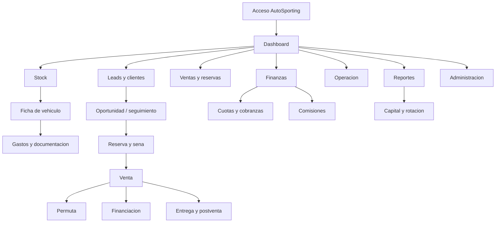
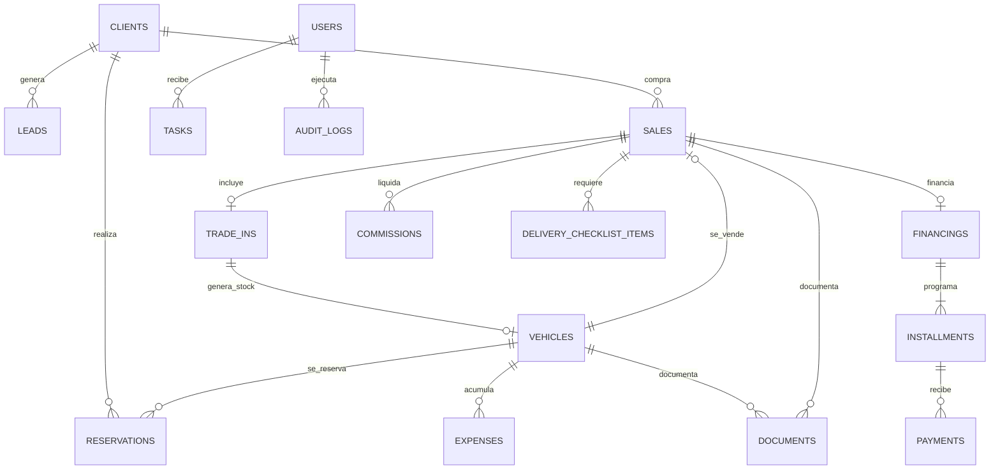

# CRM AutoSporting - Analisis Completo

## Control del documento

| Dato | Valor |
| --- | --- |
| Documento | `CRM_AUTOSPORTING_ANALISIS_COMPLETO.md` |
| Proyecto objetivo | CRM propio de AutoSporting, Argentina |
| Version actual | `0.2.1` - prompt tecnico final para Antigravity |
| Fecha de actualizacion | 2026-05-26 (America/Buenos_Aires) |
| CRM de referencia | `https://crm-sote-auto.web.app/v2/login/` |
| Prompt de implementacion | `CRM_AUTOSPORTING_PROMPT_FINAL_ANTIGRAVITY.md` |
| Alcance observado a la fecha | Autenticacion publica; shell interno; dashboard; stock, clientes, cotizaciones, ventas; operacion; finanzas; reportes; calendario; NPS; administracion; responsive interno movil |
| Estado de area autenticada | Navegacion y modulos principales confirmados en sesion de consulta; detalle de registros reales y algunos formularios secundarios siguen pendientes |
| Proposito | Especificacion funcional y visual incremental para construir una solucion original inspirada en patrones observables, sin copiar codigo ni activos privados |

### Como leer este documento

| Etiqueta | Interpretacion |
| --- | --- |
| **CONFIRMADO VISUALMENTE** | Fue observado en una pantalla renderizada del CRM de referencia durante el relevamiento. |
| **CONFIRMADO POR MEDICION RENDERIZADA** | Fue obtenido del estilo calculado o dimensiones visibles de la interfaz publica renderizada, no de codigo fuente privado. |
| **PROPUESTA AUTOSPORTING** | Requisito recomendado para el producto propio; no afirma que el CRM de referencia lo incluya. |
| **NO CONFIRMADO - falta evidencia visual** | No se vio aun en capturas, video o navegacion observable y no debe presentarse como hallazgo del CRM de referencia. |

### Limites eticos y de propiedad intelectual

Este analisis documenta experiencia de uso, composicion visual observable, necesidades de negocio y una arquitectura original para AutoSporting. No solicita ni reproduce codigo fuente, bases de datos, credenciales, logos ajenos, archivos internos o informacion de clientes del CRM de referencia. En la version AutoSporting deben sustituirse marca, textos de identidad, activos y decisiones propias de Sote por identidad y contenido originales de AutoSporting.

### Evidencias registradas

| ID | Fecha | Evidencia observada | Estado |
| --- | --- | --- | --- |
| EV-001 | 2026-05-26 | Ruta publica `/v2/login/` a `1280x720`: tarjeta de acceso centrada, identidad SOTE, email, contrasena, recuperacion e ingreso. | Confirmado |
| EV-002 | 2026-05-26 | Ruta publica `/v2/forgot-password/` a `1280x720`: campo email, boton inicialmente deshabilitado y enlace de regreso. | Confirmado |
| EV-003 | 2026-05-26 | Login renderizado a `768x1024` y `390x844`: tarjeta centrada, ajuste fluido en movil. | Confirmado |
| EV-004 | 2026-05-26 | Recuperacion: escribir un email ficticio sin enviarlo habilita visualmente el boton; no se genero solicitud de recuperacion. | Confirmado |
| EV-005 | 2026-05-26 | Sesion autenticada en `/v2/`: app tenant `Rada automotores`, shell, menu lateral, header y dashboard con vistas `Cockpit CEO` y `Dashboard general`. | Confirmado |
| EV-006 | 2026-05-26 | `/v2/stock/` y modal `Nuevo vehiculo`: tabs, estados, filtros y campos de identidad, precios, propiedad, documentacion y publicacion. | Confirmado |
| EV-007 | 2026-05-26 | `/v2/clientes/` y modal de alta: lista, pipeline, origen del lead y rotacion de asignacion declarada en UI. | Confirmado |
| EV-008 | 2026-05-26 | `/v2/cotizaciones/` y `/v2/ventas/` con modales de alta: permuta, sena, comisiones, consignacion, expediente y entrega. | Confirmado |
| EV-009 | 2026-05-26 | Modulos de operacion: pedidos, expedientes, gestoria, consignaciones, infracciones y telefonos utiles; formularios seleccionados. | Confirmado |
| EV-010 | 2026-05-26 | `/v2/finanzas/`, tesoreria y liquidaciones: tabs financieras, reglas visibles de caja y formularios de sena, cuota, pago a propietario y prestamo. | Confirmado |
| EV-011 | 2026-05-26 | Calendario, alertas, reportes, Mi Espacio, NPS, colaboracion y configuracion; se relevo estructura sin copiar mensajes o secretos. | Confirmado |
| EV-012 | 2026-05-26 | Dashboard y stock a `390x844`: header movil, navegacion inferior, accion flotante, cards y filtros adaptados. | Confirmado |
| EV-013 | 2026-05-26 | Formularios de plan automatico de cuotas y boleto compra-venta: cronograma/pagares y documento PDF de operacion. | Confirmado |

---

## 1. Resumen General Del CRM Analizado

### 1.1 Hallazgo actual del CRM de referencia

La autenticacion publica se presenta como **Sote CRM**, con interfaz oscura y acento rojo. Una vez autenticado, la sesion observada corresponde al tenant **Rada automotores** dentro de la aplicacion v2. El shell interno conserva fondo oscuro, tipografia Inter, superficies gris grafito, accion roja y una navegacion muy amplia organizada por dominio.

Quedaron confirmadas las siguientes capacidades internas:

- Dashboard ejecutivo y dashboard general con indicadores de ventas, stock, clientes, caja, cuotas, expedientes, comisiones, infracciones, pedidos, agenda y proyecciones.
- Stock con vehiculos, consignaciones y mandatos; alta que contempla precios de compra/venta, estado, propietario, documentos, MercadoLibre y escaneo de cedula verde con extraccion declarada mediante Google Vision.
- Clientes con lista y pipeline; cotizaciones; ventas con senas, permuta, consignacion, comision, documentos y checklist de entrega.
- Operacion con pedidos de vehiculos buscados, expedientes, gestoria, consignaciones, infracciones y cartelera telefonica.
- Finanzas con movimientos, senas, cuotas, pagos a propietarios, tarjeta, retiros, comisiones, rentabilidad, cuentas, cobrar/pagar, prestamos, presupuestos, recurrencias, arqueos, cierre, conciliacion y AFIP/IVA.
- Calendario, alertas, reportes, espacio personal, NPS, comunicaciones y administracion/configuracion.

El relevamiento fue de solo lectura: se abrieron pantallas y formularios vacios, sin crear operaciones, enviar mensajes, enviar encuestas o ejecutar integraciones. No se incorporan al documento nombres, comunicaciones ni importes reales visibles.

Siguen bajo la condicion **NO CONFIRMADO - falta evidencia visual** los detalles de fichas existentes con datos, transiciones luego de guardar, permisos efectivos por rol, descargas generadas, integraciones activas y responsive interno mas alla de las vistas movil auditadas.

### 1.2 Vision de producto AutoSporting

**PROPUESTA AUTOSPORTING:** construir un CRM integrado al sitio existente de AutoSporting que controle todo el ciclo comercial de una agencia automotriz argentina:

- Ingreso, valuacion, preparacion, publicacion, reserva, venta y entrega de vehiculos.
- Diferenciacion financiera entre unidades propias, en consignacion y participaciones de terceros.
- Captacion y seguimiento de consultas y clientes hasta su cierre o perdida.
- Gestion de senas, permutas, financiacion interna, cuotas y saldos.
- Control de gastos, comisiones, documentos, checklist de entrega y postventa.
- Tablero gerencial con capital inmovilizado, rentabilidad, dias en stock, alertas y rotacion.
- Auditoria de cambios, permisos por rol y manejo seguro de informacion personal.

### 1.3 Criterio de equivalencia

La equivalencia buscada debe ser de **calidad de experiencia y capacidad operativa**, no una clonacion:

- Reutilizar patrones observados como interfaz oscura, jerarquia compacta, componentes consistentes y acento de accion.
- Crear marca AutoSporting, copys, iconografia, datos, componentes y logica de implementacion propios.
- Tomar el shell oscuro interno ahora confirmado como referencia de experiencia, sin copiar branding ni defectos detectados.

---

## 2. Mapa Completo De Pantallas

### 2.1 Pantallas observadas del CRM de referencia

| ID | Ruta observada | Pantalla | Estado de evidencia | Navegacion/accion visible |
| --- | --- | --- | --- | --- |
| REF-AUTH-01 | `/v2/login/` | Iniciar sesion | **CONFIRMADO VISUALMENTE** | Email, contrasena, `Ingresar`, enlace a recuperacion |
| REF-AUTH-02 | `/v2/forgot-password/` | Recuperar contrasena | **CONFIRMADO VISUALMENTE** | Email, `Enviarme el link`, enlace para volver al login |
| REF-APP-00 | `/v2/` | Dashboard / Cockpit CEO / Dashboard general | **CONFIRMADO VISUALMENTE** | KPIs, objetivos, caja, agenda, stock y reportes enlazados |
| REF-APP-01 | `/v2/calendario/` | Calendario | **CONFIRMADO VISUALMENTE** | Calendario mensual, filtros, Google Calendar, nuevo evento |
| REF-APP-02 | `/v2/alertas/` | Centro de alertas | **CONFIRMADO VISUALMENTE** | Prioridades alta/media/baja y novedades |
| REF-APP-03 | `/v2/reportes/` | Reportes y analisis | **CONFIRMADO VISUALMENTE** | Ventas, vendedores, leads, clientes y stock |
| REF-APP-04 | `/v2/mi-espacio/` | Area personal | **CONFIRMADO VISUALMENTE** | Ventas, pagos, deudas, cuotas, autos, patrimonio y pendientes |
| REF-COM-01 | `/v2/stock/` | Stock | **CONFIRMADO VISUALMENTE** | Vehiculos, consignaciones, mandatos, estados, filtros y alta |
| REF-COM-02 | `/v2/clientes/` | Clientes / pipeline | **CONFIRMADO VISUALMENTE** | Lista, kanban, importacion/exportacion y alta |
| REF-COM-03 | `/v2/cotizaciones/` | Cotizaciones | **CONFIRMADO VISUALMENTE** | Estados, busqueda, filtros y formulario con permuta |
| REF-COM-04 | `/v2/ventas/` | Ventas | **CONFIRMADO VISUALMENTE** | Estados, permuta, sena, consignacion, comision y entrega |
| REF-OPS-01 | `/v2/wishlist/` | Pedidos | **CONFIRMADO VISUALMENTE** | Busquedas de vehiculos que no estan en stock |
| REF-OPS-02 | `/v2/expedientes/` | Expedientes | **CONFIRMADO VISUALMENTE** | En proceso, transferidos y finalizados |
| REF-OPS-03 | `/v2/gestoria/` | Gestoria / transferencias | **CONFIRMADO VISUALMENTE** | Recibos PDF y boletos |
| REF-OPS-04 | `/v2/consignaciones/` | Consignaciones | **CONFIRMADO VISUALMENTE** | Pipeline de contacto/publicacion/consignacion |
| REF-OPS-05 | `/v2/infracciones/` | Infracciones | **CONFIRMADO VISUALMENTE** | Gestion y liquidacion de multas externas |
| REF-OPS-06 | `/v2/telefonos/` | Telefonos utiles | **CONFIRMADO VISUALMENTE** | Cartelera compartida |
| REF-FIN-01 | `/v2/finanzas/` | Administracion financiera | **CONFIRMADO VISUALMENTE** | 18 sub-vistas y recibo/boleto |
| REF-FIN-02 | `/v2/tesoreria/` | Tesoreria | **CONFIRMADO VISUALMENTE** | Expedientes activos/procesados/caidos |
| REF-FIN-03 | `/v2/liquidaciones/` | Liquidaciones de gestoria | **CONFIRMADO VISUALMENTE** | Transferencias y resumen mensual |
| REF-COL-01 | `/v2/whatsapp/`, `/v2/conversaciones/`, `/v2/correos/`, `/v2/nps/` | Comunicaciones y satisfaccion | **CONFIRMADO ESTRUCTURALMENTE** | Bandejas, conexiones y NPS; no se leyeron mensajes |
| REF-ADM-01 | `/v2/autorizaciones/`, `/v2/dormidos/`, `/v2/sugerencias/`, `/v2/papelera/`, `/v2/configuracion/` | Administracion | **CONFIRMADO ESTRUCTURALMENTE** | Aprobaciones, recuperacion y parametros de sistema |

### 2.2 Arquitectura de informacion propuesta para AutoSporting

Todas las pantallas siguientes son **PROPUESTA AUTOSPORTING** hasta que una evidencia permita compararlas con el referente.

| Area | Ruta sugerida | Pantalla | Objetivo principal |
| --- | --- | --- | --- |
| Acceso | `/crm/login` | Ingreso | Autenticar usuarios del equipo |
| Acceso | `/crm/recuperar-clave` | Recuperacion | Solicitar restauracion segura |
| Inicio | `/crm/dashboard` | Tablero ejecutivo | Capital, stock, oportunidades, cobranzas y alertas |
| Stock | `/crm/stock` | Inventario | Buscar, filtrar y operar unidades |
| Stock | `/crm/stock/nuevo` | Alta de unidad | Registrar compra, consignacion o permuta entrante |
| Stock | `/crm/stock/:id` | Ficha de vehiculo | Centralizar costos, fotos, documentos, historial y disponibilidad |
| Stock | `/crm/stock/:id/edicion` | Edicion de unidad | Ajustar datos controlados y precios |
| Leads | `/crm/leads` | Pipeline comercial | Gestionar consultas y etapas de venta |
| Leads | `/crm/leads/:id` | Detalle de oportunidad | Contactos, tareas, vehiculo de interes y cotizacion |
| Clientes | `/crm/clientes` | Directorio | Administrar personas y empresas |
| Clientes | `/crm/clientes/:id` | Ficha cliente | Historial de compras, documentos y comunicaciones |
| Reservas | `/crm/reservas` | Reservas y senas | Controlar bloqueos temporales y dinero recibido |
| Ventas | `/crm/ventas` | Operaciones | Listado y estado de ventas |
| Ventas | `/crm/ventas/nueva` | Flujo de venta | Convertir reserva/lead en contrato operativo |
| Ventas | `/crm/ventas/:id` | Expediente de venta | Cobros, permuta, entrega, comision y documentos |
| Permutas | `/crm/permutas` | Valuaciones | Registrar unidades recibidas o potenciales |
| Finanzas | `/crm/financiaciones` | Creditos internos | Planes otorgados y exposicion |
| Finanzas | `/crm/cobranzas` | Cuotas y vencimientos | Cobrar, conciliar y alertar mora |
| Finanzas | `/crm/gastos` | Egresos | Registrar gastos por unidad o generales |
| Finanzas | `/crm/comisiones` | Liquidaciones | Calcular y aprobar comisiones |
| Operacion | `/crm/tareas` | Agenda interna | Vencimientos y seguimientos |
| Operacion | `/crm/documentacion` | Pendientes documentales | Legajos de vehiculos y ventas |
| Operacion | `/crm/entregas` | Checklist de entrega | Preparar entrega y postventa |
| Reportes | `/crm/reportes` | Centro de reportes | Indicadores gerenciales exportables |
| Administracion | `/crm/usuarios` | Usuarios y roles | Acceso, permisos y actividad |
| Administracion | `/crm/configuracion` | Parametros | Alertas, listas, monedas y plantillas |
| Auditoria | `/crm/auditoria` | Historial | Trazabilidad de cambios sensibles |

### 2.3 Navegacion propuesta



### 2.4 Orden recomendado del menu lateral AutoSporting

| Orden | Item | Subitems o accesos |
| --- | --- | --- |
| 1 | Dashboard | Alertas accionables |
| 2 | Stock | Vehiculos, agregar unidad, rotacion |
| 3 | Comercial | Leads, clientes, reservas, ventas |
| 4 | Finanzas | Cobranzas, financiaciones, gastos, comisiones |
| 5 | Operacion | Tareas, documentacion, entregas, postventa |
| 6 | Reportes | Capital, margen, rotacion, rendimiento |
| 7 | Administracion | Usuarios, permisos, configuracion, auditoria |

**CONFIRMADO VISUALMENTE:** el referente organiza el menu interno en `Principal`, `Comercial`, `Operacion`, `Finanzas`, `Colaboracion` y `Administracion`. En desktop el sidebar mide `256px`; en movil se reemplaza por hamburger y navegacion inferior de cinco accesos. La agrupacion propuesta AutoSporting simplifica el menu para centrarlo en su operatoria.

---

## 3. Descripcion Pantalla Por Pantalla

## 3.1 Pantallas confirmadas del referente

### REF-AUTH-01 - Iniciar sesion

| Aspecto | Observacion confirmada |
| --- | --- |
| Proposito | Acceso de usuarios con credenciales del CRM |
| Marca visible | Isotipo cuadrado rojo con texto `SOTE`; debajo, texto espaciado `SOTE CRM` |
| Titulo | `Iniciar sesion` en la representacion visual; el contenido renderizado lleva acentuacion espanola |
| Texto auxiliar | `Usa tus credenciales del CRM para entrar.` representado con voseo/acentuacion en pantalla |
| Campos | `Email`, `Contrasena` |
| Accion primaria | Boton ancho completo `Ingresar` |
| Accion secundaria | Enlace `¿Olvidaste tu contrasena?` junto a la etiqueta de contrasena |
| Disposicion | Tarjeta unica, centrada en el viewport, fondo de pagina oscuro con resplandor rojo superior-izquierdo y azulado inferior-derecho visible |
| Riesgo de copia | Marca y copy SOTE deben sustituirse por AutoSporting |

#### Medidas renderizadas confirmadas, viewport `1280x720`

| Elemento | Dimensiones/estilo medido |
| --- | --- |
| Tarjeta | `384 x 459 px`, posicion centrada, padding `32px`, borde `1px solid rgb(51,51,58)`, radio `16px` |
| Fondo tarjeta | `rgba(30,30,36,0.8)` |
| Sombra tarjeta | sombra inferior amplia equivalente a `0 25px 50px -12px rgba(0,0,0,0.25)` |
| Titulo | `24px`, peso `800`, line-height `32px`, tracking aproximado `-0.6px`, blanco |
| Texto auxiliar | `14px`, line-height `20px`, color `rgb(161,161,170)` |
| Inputs | `318 x 40 px`, padding `8px 12px`, radio `8px`, fondo `rgb(30,30,36)`, borde `rgb(51,51,58)` |
| Enlace recuperar | `11px`, color `rgb(161,161,170)` |
| Boton ingreso | `318 x 40 px`, radio `8px`, texto blanco `14px` semibold y brillo rojo |

#### Estados observados

| Estado | Resultado |
| --- | --- |
| Reposo del input de login | Fondo oscuro y borde gris oscuro |
| Boton primario de login | Visible con acento/halo rojo |
| Hover del boton | **NO CONFIRMADO - falta evidencia visual** |
| Error de credenciales | **NO CONFIRMADO - falta evidencia visual**; no se envio formulario |
| Sesion iniciada / redireccion | **NO CONFIRMADO - falta evidencia visual** |

#### Adaptacion AutoSporting sugerida

- Sustituir isotipo y nombre por logo AutoSporting original.
- Mantener, si se aprueba la identidad, una tarjeta oscura compacta y un color de accion propio basado en el rojo deportivo.
- Copy recomendado: `Iniciar sesion` y `Ingresa a la gestion de AutoSporting`.
- Integrar recuperacion real mediante proveedor de autenticacion, sin revelar si un correo esta registrado.

### REF-AUTH-02 - Recuperar contrasena

| Aspecto | Observacion confirmada |
| --- | --- |
| Proposito | Solicitar enlace para definir una nueva contrasena |
| Titulo | `Recuperar contrasena` |
| Explicacion | Indica que se enviara un link por mail para crear una nueva clave |
| Campo | `Email`, placeholder visible `vos@empresa.com` |
| Accion primaria | `Enviarme el link` |
| Accion secundaria | Enlace `Volver al login`, precedido visualmente por flecha hacia la izquierda |
| Estado inicial | El campo recibe foco y el boton aparece deshabilitado |
| Estado con email ficticio | El boton queda habilitado; no se hizo click ni envio |

#### Medidas renderizadas confirmadas, viewport `1280x720`

| Elemento | Dimensiones/estilo medido |
| --- | --- |
| Tarjeta | `384 x 433 px`, padding `32px`, borde y radio equivalentes al login |
| Titulo | `24px`, peso `800`, blanco |
| Texto auxiliar | `14px`, ocupa dos lineas |
| Campo email enfocado | `318 x 40 px`, borde rojo `rgb(239,51,41)` y halo de foco rojo translucido de `2px` |
| Boton | `318 x 40 px`, radio `8px`; habilitado utiliza degradado rojo observable |
| Enlace volver | ancho completo, texto centrado, `12px`, gris secundario |

#### Estado de boton habilitado

**CONFIRMADO POR MEDICION RENDERIZADA:** tras introducir un correo ficticio sin enviar el formulario, el boton utiliza un degradado aproximado:

```text
linear-gradient(135deg, rgb(230, 48, 39), rgb(196, 38, 32))
```

Los mensajes posteriores al envio, estados de exito, error, token vencido y pantalla de cambio de clave son:

> **NO CONFIRMADO - falta evidencia visual**

### REF-AUTH-03 - Respuesta responsive del login

| Viewport observado | Comportamiento confirmado |
| --- | --- |
| Desktop `1280x720` | Tarjeta `384px` centrada; contenido interior `318px` |
| Tablet `768x1024` | Mantiene tarjeta `384px` e inputs `318px`, centrados |
| Movil `390x844` | Tarjeta se reduce a `342px`, con margen exterior `24px`; inputs y boton pasan a `276px` |

#### Inferencia util para AutoSporting

El acceso usa un contenedor con maximo cercano a `384px` y ancho fluido limitado por margenes laterales de `24px`. Este patron se puede recrear de forma original y accesible para las pantallas de autenticacion de AutoSporting.

## 3.2 Pantallas internas confirmadas del referente

### REF-INT-01 - Shell autenticado y navegacion global

| Aspecto | Observacion confirmada |
| --- | --- |
| Tenant estable observado | `Rada automotores`, version `v2` |
| Estado intermedio observado | Durante carga algunas vistas mostraron `Sote CRM` antes de resolver el tenant; validar parpadeo de branding |
| Sidebar desktop | Fijo a izquierda, `256px` medidos, fondo `rgb(22,22,25)`, marca, secciones, perfil/rol, cierre de sesion y recarga |
| Header desktop | Superior, `56px` medidos, buscador global, banda de caja/ventas, modo dia, notificaciones y perfil |
| Contenido | Area principal con fondo `rgb(11,11,13)`, margen interior y cards |
| Acciones flotantes | Boton circular de acciones rapidas y acceso a mensajes/notificaciones |

#### Items del sidebar confirmados

| Grupo | Items visibles |
| --- | --- |
| Principal | Dashboard, Calendario, Alertas, Reportes, Mi Espacio |
| Comercial | Stock, Clientes, Cotizaciones, Ventas, Mis ventas |
| Operacion | Pedidos, Expedientes, Gestoria, Consignaciones, Infracciones, Telefonos utiles |
| Finanzas | Finanzas, Tesoreria, Liquidaciones, Mis Comisiones |
| Colaboracion | Mensajes, WhatsApp, Conversaciones (Arturito), Correos, NPS |
| Administracion | Autorizaciones, Dormidos, Sugerencias, Papelera, Configuracion |

### REF-INT-02 - Dashboard

| Vista | Componentes confirmados |
| --- | --- |
| `Cockpit CEO` | Avance del mes, selector temporal, estado en vivo, autos vendidos contra objetivo, ganancia mensual contra objetivo/proyeccion, ganancia por auto, operacion personal, comparacion interanual, infracciones, gestoria/transferencias, calificaciones, proyeccion de caja, grafico de 12 meses y resumen anual |
| `Dashboard general` | Revenue, stock activo, operaciones, clientes sin contactar, vehiculos en stock, ventas, cuotas a pagar, balance, recordatorios, alertas, ticket promedio, stock vendido, cotizaciones, expedientes, comisiones, infracciones, pedidos, proyeccion de caja, estado de stock, agenda, vencimientos, top vendedores, ventas semestrales, showroom, matching de pedidos y operaciones recientes |
| Privacidad operativa | Boton visible `Ocultar montos` |
| Navegacion contextual | Cards enlazan a los modulos asociados |

**CONFIRMADO POR MEDICION RENDERIZADA:** las cards del cockpit utilizan superficie `rgb(30,30,36)`, borde `rgb(51,51,58)`, radio `16px`, padding `20px` y sombra sutil. El tab seleccionado usa texto/acento rojo `rgb(239,51,41)`.

### REF-INT-03 - Stock y alta de vehiculo

| Zona | Contenido confirmado |
| --- | --- |
| Cabecera | Conteo de disponibles, valor activo, exportacion XLSX, `Nuevo mandato + Stock`, `Nuevo vehiculo` |
| Subvistas | `Stock general`, `Consignaciones`, `Mandatos` |
| Estados | `Disponible`, `Senado`, `Vendido sin confirmar`, `Vendido` |
| Busqueda/filtro | Marca, modelo, patente, ano, propietario, telefono, consignacion, ubicacion y notas; filtro por marca |
| Empty state | Mensaje para cargar el primer vehiculo |

#### Modal `Nuevo vehiculo` confirmado

| Seccion | Campos o comportamiento observado |
| --- | --- |
| Captura inteligente | Subida opcional de foto de cedula verde; el copy declara uso de Google Vision para extraer patente, marca, modelo, ano y VIN con revision posterior |
| Identidad | Tipo de vehiculo, marca, modelo, ano, patente/VIN, condicion, color |
| Precio y estado | Kilometros, precio de venta y moneda, precio de compra y moneda, estado inicial, ubicacion, cantidad de duenos |
| Tipos de vehiculo | Auto, camioneta/SUV, pick-up, moto, cuatriciclo, UTV, moto de agua, nautica, camion y otro |
| Estados iniciales | Disponible, reservado, senado, vendido, en preparacion |
| Propietario | Toggle de vehiculo propio, nombre, cliente vinculado, telefono, email, responsable de consignacion, numero de motor y chasis |
| Documentacion | Manuales, duplicado de llaves y servicios oficiales con opciones no/si/parcial |
| Publicacion | Publicado en MercadoLibre, publicado por, link MercadoLibre y notas |
| Acciones | Cancelar y dar de alta |

**NO CONFIRMADO - falta evidencia visual:** ficha de un vehiculo ya creado, historial de cambios, edicion y reglas efectivas de validacion.

### REF-INT-04 - Clientes y pipeline

| Zona | Contenido confirmado |
| --- | --- |
| Cabecera | Totales de clientes/activos/nuevos, exportar XLSX, importar XLSX y nuevo cliente |
| Vistas | `Lista` y `Pipeline` |
| Filtros lista | Mis clientes, sin contactar, contactados, todos y busqueda |
| Pipeline | Filtro por vendedor y columnas `Nuevo`, `Contactado`, `Cita agendada`, `Mostrando`, `Negociacion`, `Propuesta`, `Cerrado`, `Perdido` |

#### Modal `Agregar Cliente` confirmado

| Seccion | Campos o reglas visibles |
| --- | --- |
| Captacion | Botones `Entro por la puerta` y `Lead digital (WhatsApp / IG / ML / web)` |
| Routing | Copy visible: cada canal usa una cola de rotacion independiente; un vehiculo de interes puede auto-asignar al vendedor que lo consigna |
| Datos | Nombre completo obligatorio, tipo regular/VIP, DNI/CUIT, telefono, email, origen, etapa pipeline |
| Interes | Vehiculo del stock o busqueda libre |
| Seguimiento | Fecha de nacimiento, ultimo contacto, fecha de alta, vendedor asignado, direccion, notas y adjuntos |

### REF-INT-05 - Cotizaciones y ventas

| Pantalla | Listado confirmado |
| --- | --- |
| Cotizaciones | Tabs pendientes/aprobadas/rechazadas; busqueda; estado detallado; vendedor; fechas; accion `Nueva cotizacion` |
| Ventas | Tabs todas/borradores/activas/reservas/cerradas/caidas/canceladas; busqueda por comprador/unidad/DNI/telefono; vendedor; pago; fechas; solo permuta; mes; exportar; `Nueva venta` |

#### Modal `Nueva cotizacion` confirmado

| Seccion | Campos |
| --- | --- |
| Cliente y vehiculo | Cliente CRM o nombre libre, vehiculo stock o descripcion libre, vendedor |
| Permuta | Marca, modelo, ano, kilometros, estado general y patente/dominio |
| Precio | Precio sugerido, moneda USD/ARS, fecha de emision, vencimiento, condiciones de pago y notas |
| Estado inicial | El copy declara que nace `Pendiente` y se cambia desde detalle |

#### Modal `Nueva venta` confirmado

| Seccion | Campos o reglas visibles |
| --- | --- |
| Importacion historica | Toggle de carga manual: venta nace cerrada y no abre expediente ni notifica a Gestoria/Tesoreria |
| Operacion | Vehiculo, estado, kilometraje, precio comprador, moneda, vendedor y fecha de cierre |
| Comprador | Cliente CRM, nombre, telefono, email, DNI |
| Propietario | Datos manuales cuando no hay stock vinculado |
| Pagos | Agregar sena con monto/moneda/fecha/comprobante; metodo contado, financiado, leasing, permuta o criptomonedas; cuotas habilitadas si corresponde |
| Permuta | Toggle para vehiculo entregado en parte de pago |
| Consignacion/gestoria | Responsable de consignacion y gestor asignado |
| Comision | Regla fija visible, edicion manual, extra al cliente, moneda extra y split de vendedores |
| Entrega | Tuerca de seguridad, duplicado de llave, manuales y cedula |
| Expediente | DNI frente/dorso, cedula verde frente/dorso, fecha de entrega y notas |

### REF-INT-06 - Operacion

| Modulo | Funcionalidad confirmada | Campos/estados confirmados |
| --- | --- | --- |
| Pedidos | Registrar lo que un cliente busca y aun no esta en stock | Cliente opcional, contacto, marca/modelo, ano desde/hasta, presupuesto/moneda, vendedor, estado activo/cumplido/cancelado, notas |
| Expedientes | Seguimiento de operaciones/documentacion | En proceso, transferidos, finalizados; busqueda y gestor |
| Gestoria | Estado de transferencias y documentos | Recibo PDF con receptor, importe, concepto y pago; boleto PDF con fecha/lugar, comprador, importe, unidad (marca, tipo, modelo, motor, chasis, dominio) y forma de pago |
| Consignaciones | Captacion de unidad para consignar | Cliente, telefono, descripcion de unidad, vendedor, fecha, ultimo contacto, notas; estados pendiente contacto, contactado, agendado, ingreso al local, publicado, consignado y cancelado |
| Infracciones | Gestion de multas para clientes externos | Fecha/mes, jurisdiccion, estado, cliente/dominio, deuda, pago cliente, pago real, medio, planilla, gestor, vehiculo y comentarios |
| Telefonos utiles | Cartelera compartida | Accion de nuevo telefono |

### REF-INT-07 - Finanzas, tesoreria y liquidaciones

| Modulo | Elementos confirmados |
| --- | --- |
| Administracion Financiera | Tabs: resumen, movimientos, senas, cuotas, pagos disponibles, tarjeta, retiros, comisiones, rentabilidad, cuentas, cobrar/pagar, prestamos, presupuesto, recurrencias, arqueos, cierre caja, conciliacion y AFIP/IVA |
| Tesoreria | Expedientes activos, procesados y operaciones caidas; busqueda |
| Liquidaciones | Transferencias, liquidacion mensual y resumen agencia; sincronizacion con expedientes, limpieza de duplicados y nueva transferencia |

#### Sub-vistas financieras relevantes

| Tab | Comportamiento confirmado |
| --- | --- |
| Resumen | Saldos por cuentas y monedas, actividad acumulada, cuotas y graficos de flujo/categorias |
| Movimientos | Tipos ingreso/egreso/transferencia, filtros temporales y por caja, tabla con edicion/eliminacion y exportacion |
| Senas | Totales recibidos/aplicados, estados recibida/aplicada/devuelta; el copy indica que recibida y devuelta generan movimiento, aplicada no toca caja |
| Cuotas | Pendiente/abonado/vencido/proximo; cuota individual y `Plan automatico`; el plan solicita deudor, vehiculo opcional, acreedor, monto/moneda, cantidad, frecuencia, primer vencimiento y puede generar pagares PDF |
| Pagos Disp. | Pago pendiente/disponible/cobrado al propietario; cobrado genera egreso automatico |
| Comisiones | Pendientes/pagadas/todas; edicion de porcentajes y extra inline segun copy |
| Rentabilidad | Se limita al area Finanzas/Gestoria; la ganancia de venta se envia a Reportes |
| Cuentas | Cuentas y fondos con moneda y saldo; alta/edicion/eliminacion |
| x Cobrar/Pagar | Por cobrar: vehiculos, cuotas, gastos comprador. Por pagar: propietarios, transferencias a registros y comisiones |
| Prestamos | Persona, monto, devolucion esperada, motivo y estado; genera egreso desde caja |
| Recurrencias | Plantillas mensuales para ingresos/gastos recurrentes |
| Arqueos | Comparacion de saldo calculado contra efectivo contado con motivo de diferencia |
| Cierre Caja | Snapshot historico de saldos por caja al final del dia |
| Conciliacion | Scaffold de importacion CSV y matching por monto/fecha |
| AFIP/IVA | Scaffold fiscal: comprobante A/B/C/Exenta e IVA; texto visible indica que DDJJ, retenciones e integracion web service quedan para fase posterior |

### REF-INT-08 - Calendario, alertas y reportes

| Pantalla | Confirmacion |
| --- | --- |
| Calendario | Vista mensual, proximos/pasados/todos, filtros por fechas/tipo/creador, boton de conexion Google Calendar y alta de evento |
| Evento | Titulo, tipo reunion/entrega/vencimiento/seguimiento/pago/llamada/otro, fecha/hora, sector a notificar, color, cliente, vehiculo, creador y notas |
| Alertas | Bandeja priorizada con contadores de alta, novedades, media y baja |
| Reportes | Competencia del mes, volumen ventas mensual, operaciones por vendedor, origen de leads, top clientes, stock por estado y por marca |

### REF-INT-09 - Mi Espacio, colaboracion y NPS

| Modulo | Elementos confirmados sin lectura de comunicaciones |
| --- | --- |
| Mi Espacio | Area declarada como personal; tabs mi dia, mis ventas, urgente, pagos, deudas, gastos fijos, cuotas a pagar/cobrar, saldo agencia, mis autos, patrimonio, pendientes, calendario y contactos |
| WhatsApp / Conversaciones (Arturito) | Tabs bandeja, leads y nuevo mensaje; busqueda; no se abrieron conversaciones ni enviaron mensajes |
| Correos | Conectar con Google, cambiar Client ID y borrar configuracion; no se ejecuto ninguna accion |
| NPS | Dashboard de respuestas y score; formulario permite enviar WhatsApp o registrar respuesta, vincular cliente/vendedor y definir contexto de contacto |

**Hallazgo UX:** el modal de NPS observado usa superficie clara mientras la aplicacion circundante usa tema oscuro. Para AutoSporting se recomienda unificar tema y tokens.

### REF-INT-10 - Administracion y seguridad observable

| Modulo | Elementos confirmados |
| --- | --- |
| Autorizaciones | Pendientes, historico y PIN de emergencia; texto indica trazabilidad por motivo, fecha y usuario |
| Dormidos | Clientes dormidos, util como seguimiento de inactividad |
| Sugerencias | Nueva sugerencia, lista/agrupacion, estados y categorias de mejora |
| Papelera | Ventas y expedientes eliminados con busqueda |
| Configuracion | Usuarios, empresa, WATI, Arturito, agente IA, flags de migracion, backups, 2FA admin y sistema |
| Empresa | Comisiones, objetivos, gestoria, infracciones, fiscal, SLA, finanzas, leaderboard, lead routing y branding |
| Integraciones | WATI; Arturito; agente WhatsApp con OpenAI; endpoints/tokens no fueron leidos ni documentados |
| Backups / seguridad | Backup diario indicado en UI, descarga local on-demand y TOTP para administradores |

**Hallazgo de seguridad critico a no replicar:** la vista Usuarios informa que la contrasena se guarda hasheada con `bcrypt`, pero que un sistema legacy todavia mantiene plaintext en paralelo durante la migracion. AutoSporting debe almacenar exclusivamente hashes seguros y nunca conservar contrasenas reversibles o en texto plano.

### REF-INT-11 - Responsive interno confirmado

| Viewport | Comportamiento visible |
| --- | --- |
| Desktop auditado | Sidebar `256px`, header `56px`, cards en grillas amplias |
| Movil `390x844` dashboard | Sidebar reemplazado por boton de menu; header compacto; KPIs en dos columnas; accion flotante; navegacion inferior fija |
| Movil `390x844` stock | Acciones se envuelven en filas; tabs y chips se adaptan; busqueda y selector ocupan ancho; navegacion inferior fija |

**Hallazgo tecnico observable:** en la vista movil del dashboard el acceso flotante a `Mensajes` expuso una ruta `/v2/v2/mensajes/`. AutoSporting debe construir enlaces desde un unico `basePath` probado para evitar duplicaciones.

## 3.3 Pantallas propuestas para AutoSporting

### AS-01 - Dashboard ejecutivo

**Objetivo:** permitir que direccion entienda en menos de un minuto cuanto capital hay inmovilizado, que unidades requieren accion y que cobros/entregas estan proximos.

| Sector | Contenido requerido |
| --- | --- |
| Header | Titulo `Dashboard`, selector de periodo, moneda de lectura (`ARS`/`USD`), fecha de actualizacion |
| KPI fila 1 | Unidades disponibles, reservadas y vendidas del periodo; capital total de stock; capital propio; capital de terceros |
| KPI fila 2 | Margen estimado total, antiguedad promedio, unidades `>60 dias`, unidades `>90 dias`, cuotas vencidas |
| Panel rotacion | Tabla corta de vehiculos mas antiguos con accion `Ver unidad` y recomendacion operativa |
| Panel comercial | Leads por etapa, proximas tareas y reservas por vencer |
| Panel financiero | Cobros de los proximos 7 dias, morosidad y comisiones pendientes |

**Estados:** carga con skeleton; sin datos con explicacion accionable; alerta roja solo para vencidos/riesgo alto; alerta ambar para seguimiento proximo.

**Referencia:** el referente confirma dashboard ejecutivo/general, caja, ventas, stock, cuotas, agenda y alertas. Los indicadores especificos de capital propio, terceros y aging `60/90` permanecen como requerimientos propios AutoSporting.

### AS-02 - Stock de vehiculos

| Elemento | Especificacion |
| --- | --- |
| Vista principal | Tabla en escritorio y cards compactas en movil |
| Busqueda | Dominio/patente, marca, modelo, version, codigo interno o propietario |
| Filtros | Estado, origen, titularidad, moneda, rango de precio, sucursal, dias en stock, documentacion pendiente |
| Columnas esenciales | Foto, unidad, patente, ano/km, origen, estado, dias en stock, costo total, precio publicado, margen estimado, acciones |
| Acciones por fila | Ver, editar con permiso, reservar, registrar gasto, marcar estrategia, archivar solo si corresponde |
| Accion superior | `Agregar vehiculo` |
| Indicadores | Badge `+60 dias`, badge critico `+90 dias`, consignacion, reservado, documentacion pendiente |

### AS-03 - Alta y ficha de vehiculo

La ficha debe ser la fuente central de la unidad y dividirse en tabs:

| Tab | Informacion |
| --- | --- |
| General | Identificacion, caracteristicas, estado operativo, origen |
| Comercial | Precio publicado, minimo, canal de publicacion, consultas y reserva |
| Costos | Compra, gastos asociados, reparaciones, costo total y margen |
| Propiedad | Propio, consignacion o tercero; participacion y liquidacion |
| Fotos | Multimedia propia, orden de publicacion y estado |
| Documentos | Cedula/titulo, verificacion y pendientes configurables |
| Historial | Cambios de precio, estados, gastos, reserva, venta y auditoria |

### AS-04 - Leads y clientes

| Pantalla | Necesidad |
| --- | --- |
| Pipeline de leads | Columnas de etapa: nuevo, contactado, visita, cotizado, negociacion, reserva, ganado, perdido |
| Detalle lead | Datos de contacto, origen, vehiculo de interes, permuta potencial, presupuesto, mensajes resumidos, tareas |
| Clientes | Directorio deduplicado con historial de operaciones |
| Privacidad | DNI, domicilio y archivos personales solo visibles para roles autorizados |

### AS-05 - Reservas, senas y ventas

| Pantalla | Necesidad |
| --- | --- |
| Reserva | Seleccionar cliente y unidad, importe de sena, vigencia, condiciones y recibo |
| Venta | Precio final, cobros, saldo, permuta, financiacion, vendedor y documentacion |
| Expediente | Timeline completo hasta entrega; no se pierde la evidencia de cambios |
| Entrega | Checklist, firma/confirmacion, obsequio y seguimiento posterior |

### AS-06 - Permutas

La valuacion debe poder existir antes de una venta y convertirse en unidad de stock cuando se acepta:

| Sector | Contenido |
| --- | --- |
| Identidad unidad recibida | Patente, marca, modelo, version, ano, kilometros, titular |
| Evaluacion | Estado mecanico/estetico, documentacion, deudas/infracciones declaradas, fotos |
| Valores | Valor pretendido, valuacion interna, valor tomado en operacion |
| Decision | En analisis, rechazada, aceptada, incorporada a stock |
| Vinculos | Lead, cliente, venta que la recibe y nueva unidad de stock |

### AS-07 - Financiacion interna y cobranzas

| Pantalla | Necesidad |
| --- | --- |
| Nuevo plan | Capital financiado, moneda, cantidad de cuotas, interes, periodicidad y vencimientos |
| Plan activo | Cronograma, total cobrado, saldo, estado y documentos |
| Cobranzas | Cuotas por vencer/vencidas, registro de pago parcial o completo, comprobante |
| Alertas | Vence pronto, vencida, mora critica y plan cancelado |

### AS-08 - Gastos, comisiones y reportes

| Pantalla | Necesidad |
| --- | --- |
| Gastos | Asignar costo a vehiculo, venta o gasto general; adjuntar comprobante |
| Comisiones | Regla por vendedor/venta, base calculada, aprobacion y pago |
| Reportes | Capital, margen, rotacion, conversion comercial, flujo de cobros, gastos y comisiones |

---

## 4. Componentes Visuales Reutilizables

## 4.1 Sistema visual confirmado en autenticacion del referente

### Paleta medida

| Token descriptivo | Valor observado | Uso confirmado |
| --- | --- | --- |
| `auth.background.base` | `rgb(11, 11, 13)` / `#0B0B0D` | Fondo base de la pagina |
| `auth.surface.card` | `rgba(30, 30, 36, 0.8)` | Tarjeta de autenticacion |
| `auth.surface.input` | `rgb(30, 30, 36)` / `#1E1E24` | Inputs |
| `auth.border.default` | `rgb(51, 51, 58)` / `#33333A` | Borde de tarjeta e inputs en reposo |
| `auth.text.primary` | `rgb(250, 250, 250)` y titulo `rgb(255,255,255)` | Texto principal |
| `auth.text.secondary` | `rgb(161, 161, 170)` / `#A1A1AA` | Instruccion y enlaces |
| `auth.accent.focus` | `rgb(239, 51, 41)` / `#EF3329` | Borde/halo de foco y brillo |
| `auth.action.gradient.start` | `rgb(230, 48, 39)` / `#E63027` | Inicio del degradado habilitado |
| `auth.action.gradient.end` | `rgb(196, 38, 32)` / `#C42620` | Fin del degradado habilitado |

El fondo presenta iluminaciones decorativas roja y azul oscura en las capturas. El metodo exacto de implementacion de esos gradientes es irrelevante para la version original y no fue extraido.

### Tipografia medida

| Elemento | Familia observada | Tamano | Peso | Line height | Color |
| --- | --- | ---: | ---: | ---: | --- |
| Base | `Inter`, fallback de Inter, `system-ui`, `sans-serif` | `16px` | `400` | `24px` | `#FAFAFA` |
| H1 autenticacion | Misma familia | `24px` | `800` | `32px` | blanco |
| Texto auxiliar | Misma familia | `14px` | `400` | `20px` | `#A1A1AA` |
| Campo/control | Misma familia | `14px` | `400` | `20px` | `#FAFAFA` |
| Boton | Misma familia | `14px` | `600` | `20px` | blanco |
| Enlace recuperar login | Misma familia | `11px` | `400` | aprox. `16.5px` | `#A1A1AA` |
| Enlace volver | Misma familia | `12px` | `400` | `16px` | `#A1A1AA` |

### Geometria y espaciado medidos

| Componente | Especificacion observada |
| --- | --- |
| Pagina auth | Contenido centrado y padding exterior `24px` |
| Card | Maximo visible `384px`, padding `32px`, radio `16px`, borde `1px` |
| Control | Altura `40px`, radio `8px`, padding horizontal `12px` en inputs y `16px` en botones |
| Boton | Ancho total del contenido interior y sombra/halo rojo amplio |
| Distribucion movil | Card `calc(100vw - 48px)` a `390px`, conservando padding interior |

### Sistema visual interno confirmado

| Pieza | Estilo observado |
| --- | --- |
| Fondo aplicacion | `rgb(11,11,13)`, consistente con auth |
| Sidebar y header | `rgb(22,22,25)`; sidebar desktop `256px`, header `56px` |
| Cards dashboard | `rgb(30,30,36)`, borde `rgb(51,51,58)`, radio `16px`, padding `20px`, sombra sutil |
| Inputs/listados | Superficies oscuras, bordes grises, foco/acciones rojas |
| Tab activo | Texto y linea inferior roja; en dashboard se midio acento `rgb(239,51,41)` |
| Boton principal | Rojo brillante con halo visible, utilizado en altas |
| Badges/chips | Verde para disponible/en vivo, amarillo para advertencias, rojo para acciones/estados criticos |
| Modales principales | Overlay oscuro, panel oscuro amplio, header y footer fijos o visibles, scroll interno para formularios extensos |
| Excepcion UX | Modal NPS claro dentro del tema oscuro; inconsistencia que no debe copiarse |

## 4.2 Componentes que AutoSporting debe implementar

| Componente | Responsabilidad | Variantes/estados requeridos |
| --- | --- | --- |
| `AuthLayout` | Fondo, centrado y marca de acceso | Login, recuperacion, establecer clave |
| `AuthCard` | Superficie de formularios publicos | Desktop/movil |
| `AppShell` | Menu, header y area de contenido autenticada | Expandido, colapsado, movil overlay |
| `PageHeader` | Titulo, breadcrumb y acciones | Con filtros, con boton primario |
| `KpiCard` | Metrica y tendencia | Normal, advertencia, critica, loading |
| `DataTable` | Listados densos | Orden, filtros, seleccion, empty, loading |
| `VehicleCard` | Unidad en movil o grilla | Disponible, reservada, vendida, consignacion, envejecida |
| `FilterBar` | Busqueda y chips activos | Aplicar, limpiar, filtros guardados |
| `StatusBadge` | Estado legible y no dependiente solo del color | Exito, pendiente, advertencia, critico, neutro |
| `FormField` | Etiqueta, control, ayuda y error | Default, focus, invalid, disabled, read-only |
| `MoneyField` | Importe y moneda | ARS, USD; separadores argentinos |
| `Timeline` | Eventos de unidad/venta/cliente | Evento automatico, comentario, documento |
| `DocumentChecklist` | Pendientes y archivos | Pendiente, cargado, validado, rechazado |
| `ConfirmDialog` | Confirmar operaciones sensibles | Reserva, anulacion, venta, pago |
| `Toast` | Resultado de accion | Informativo, exito, error |
| `AlertCenter` | Vencimientos operativos | Stock antiguo, cuotas, tareas y documentos |

## 4.3 Tokens visuales propuestos para el area interna

El interior observado confirma la continuidad del tema oscuro. Estos tokens reproducen su lenguaje general como punto de partida original para AutoSporting, y deben adaptarse a la marca final:

| Token AutoSporting | Valor inicial sugerido | Motivo |
| --- | --- | --- |
| `color.background` | `#0B0B0D` | Continuidad con autenticacion observada |
| `color.surface` | `#1E1E24` | Cards/formularios |
| `color.surfaceRaised` | `#24242B` | Tablas y modales |
| `color.border` | `#33333A` | Separacion sutil |
| `color.primary` | `#E63027` | Accion AutoSporting, ajustar a branding final |
| `color.success` | `#22C55E` | Operacion completa/cobrada |
| `color.warning` | `#F59E0B` | `>60 dias`, vence pronto |
| `color.danger` | `#EF3329` | Vencido, `>90 dias`, error |
| `color.info` | `#3B82F6` | Informacion neutra |
| `text.primary` | `#FAFAFA` | Contraste alto |
| `text.secondary` | `#A1A1AA` | Metadatos |

### Estados visuales a validar o disenar

| Estado | Referente | Implementacion AutoSporting requerida |
| --- | --- | --- |
| Input default | Confirmado en auth | Borde neutro y label legible |
| Input focus | Confirmado en recuperacion: rojo + halo | Usar foco visible accesible |
| Boton enabled | Confirmado en auth | Degradado/acento propio |
| Boton disabled | Confirmado en recuperacion | Opacidad y cursor, sin depender solo del color |
| Hover | **NO CONFIRMADO - falta evidencia visual** | Definir aumento leve de luminosidad |
| Error | **NO CONFIRMADO - falta evidencia visual** | Texto explicativo + borde rojo |
| Exito/disponible/en vivo | Verde observado en badges | Badge con texto e icono |
| Pendiente/advertencia | Amarillo observado en chips/indicadores | Badge semantico |
| Seleccion tabla/menu/tab | Rojo y fondo elevado observados | Fondo/acento lateral y `aria-current` |

## 4.4 Responsive propuesto para aplicacion interna

| Breakpoint | Comportamiento requerido |
| --- | --- |
| `>= 1200px` | Sidebar fija, tabla completa, KPIs en 4-6 columnas |
| `768-1199px` | Sidebar colapsable, tablas con scroll controlado, KPIs en 2-3 columnas |
| `< 768px` | Menu drawer, listados como cards, acciones primarias sticky cuando convenga, formularios en una columna |

**CONFIRMADO VISUALMENTE:** a `390x844`, dashboard y stock ocultan el sidebar, presentan header movil, navegacion inferior fija y boton flotante. Dashboard muestra KPIs en dos columnas y stock reordena acciones/filtros. Tablet interna permanece **NO CONFIRMADO - falta evidencia visual**.

---

## 5. Flujos Funcionales

## 5.1 Flujos confirmados del referente

### Flujo REF-F01 - Login publico

1. El usuario ingresa en `/v2/login/`.
2. Visualiza marca, titulo, instruccion, campo de email, campo de contrasena y boton `Ingresar`.
3. Puede ir a recuperacion mediante el enlace visible.
4. Resultado de presionar `Ingresar`: **NO CONFIRMADO - falta evidencia visual**, porque no se enviaron credenciales durante la auditoria inicial.

### Flujo REF-F02 - Inicio de recuperacion

1. El usuario accede a `/v2/forgot-password/`.
2. El campo de email aparece enfocado y el boton esta deshabilitado sin contenido.
3. Al completar un email de prueba, el boton cambia a habilitado.
4. Envio, confirmacion, seguridad y pantalla posterior: **NO CONFIRMADO - falta evidencia visual**, porque no se envio ningun correo.

### Flujo REF-F03 - Alta de vehiculo y consignacion

1. Desde Stock existe accion `Nuevo vehiculo` y una accion separada `Nuevo mandato + Stock`.
2. El alta de vehiculo permite escanear cedula verde de manera opcional y revisar la extraccion antes de guardar.
3. El usuario completa identidad, precio/moneda, estado inicial, ubicacion, propietario o responsable de consignacion, documentos y publicacion.
4. Existe tambien un modulo `Consignaciones` para captar una unidad, asignarle vendedor y avanzar estados de contacto, ingreso y publicacion.
5. Guardado, creacion efectiva de stock y comportamiento del mandato: **NO CONFIRMADO - falta evidencia visual**, porque no se envio ningun formulario.

### Flujo REF-F04 - Cliente, pipeline y cotizacion

1. Clientes se consulta en lista o pipeline.
2. El alta distingue ingreso presencial y lead digital, y declara colas independientes de asignacion; puede asociar vehiculo de interes.
3. Las etapas observadas abarcan nuevo, contacto, cita, exhibicion, negociacion, propuesta, cierre y perdida.
4. Una cotizacion puede partir de cliente/vehiculo existentes o texto libre, e incluir una permuta y condiciones con vencimiento.

### Flujo REF-F05 - Venta y expediente

1. La nueva venta asocia vehiculo, comprador, vendedor, precio y moneda.
2. Permite senas, forma de pago, financiacion por cuotas, permuta, responsable de consignacion y gestor.
3. Incluye comision fija o manual, split, items de entrega y archivos para expediente.
4. El modo de importacion historica declara que crea venta cerrada sin expediente ni notificacion a Gestoria/Tesoreria.
5. El flujo posterior a crear/confirmar/entregar: **NO CONFIRMADO - falta evidencia visual**.

### Flujo REF-F06 - Finanzas y caja

1. El centro financiero separa movimientos, cuentas, senas, cuotas, pagos al propietario, comisiones, rentabilidad y cuentas por cobrar/pagar.
2. Una sena `Recibida` o `Devuelta` declara crear movimiento automatico; `Aplicada` declara no alterar caja.
3. La financiacion puede iniciarse con cuota individual o plan automatico de N cuotas; el plan permite generar pagares PDF multipagina.
4. Un pago a propietario se mantiene pendiente hasta marcarse cobrado; ese estado declara generar un egreso.
5. Un prestamo declara generar egreso automatico desde una caja.
6. Recurrencias, arqueos, cierres y conciliacion respaldan control interno; AFIP/IVA y conciliacion se identifican como scaffolds incompletos.

### Flujo REF-F07 - Postventa y satisfaccion

1. NPS resume puntaje, respuestas, promotores, pasivos y detractores por periodo.
2. La encuesta puede vincular cliente y vendedor y elegir contexto: postventa, visita, entrega o cotizacion.
3. El modal ofrece envio por WhatsApp o registro de respuesta.
4. No se realizo envio ni se inspeccionaron comunicaciones.

## 5.2 Flujos AutoSporting requeridos

### AS-F01 - Ingreso de vehiculo a stock

1. Usuario con permiso inicia `Agregar vehiculo`.
2. Selecciona origen: compra directa, consignacion, permuta aceptada o tercero/participacion.
3. Registra identidad de la unidad y valida que patente/VIN no duplique una unidad activa.
4. Registra costo de adquisicion o condiciones de consignacion, moneda y tipo de cambio de referencia si aplica.
5. Completa documentacion disponible y pendientes.
6. Sube fotos propias y define estado inicial: preparacion, disponible o pendiente de documentacion.
7. El sistema crea movimientos de auditoria, calcula dias en stock desde la fecha de ingreso y actualiza capital.

### AS-F02 - Preparacion, precio y publicacion

1. Operacion registra gastos de puesta a punto asociados a la unidad.
2. Responsable comercial carga precio publicado y precio minimo aceptable con permiso restringido.
3. El sistema calcula costo total y margen estimado para ambos precios.
4. Se marca canal de publicacion y fecha de publicacion.
5. Si un precio cambia, se conserva historico con usuario, fecha, anterior, nuevo y motivo.

### AS-F03 - Lead hasta reserva

1. Entra un lead manual o desde canal web/WhatsApp/red social a integrar.
2. Se asigna vendedor y etapa `nuevo`; se crea tarea de primer contacto.
3. Se vinculan uno o varios vehiculos de interes y una eventual permuta.
4. Se registran contactos, visita, cotizacion y probabilidad.
5. Cuando el cliente decide senar, se crea reserva contra una unidad disponible.
6. La reserva bloquea disponibilidad durante su vigencia y registra el importe recibido.

### AS-F04 - Sena y reserva

1. Usuario selecciona cliente, vehiculo, importe, moneda, medio de pago, vencimiento y condiciones.
2. Se genera un comprobante interno numerado; el comprobante fiscal/legal definitivo debe definirse con asesoria contable.
3. Vehiculo cambia de `disponible` a `reservado`.
4. Antes del vencimiento se alerta al vendedor.
5. Al vencer sin cierre, un usuario autorizado decide extender, devolver/retener segun condiciones o liberar la unidad; ninguna accion monetaria debe ser automatica sin registro.

### AS-F05 - Venta con o sin permuta

1. Se convierte una reserva o se inicia venta directa sobre una unidad disponible.
2. Se congela snapshot de precio acordado, costo total y vendedor responsable.
3. Se agregan cobros iniciales, sena imputada, saldo, permuta y/o plan de financiacion.
4. Se controla checklist documental y administrativo.
5. Con venta confirmada, la unidad pasa a `vendida_pendiente_entrega`.
6. Tras entrega y cierre documental, pasa a `entregada`; se calcula margen realizado y comisiones.

### AS-F06 - Permuta recibida

1. Durante lead o venta se carga vehiculo ofrecido.
2. Un responsable registra valuacion, revision y documentos.
3. Si se acepta, el valor de toma forma parte del pago de venta.
4. En la confirmacion, se puede generar automaticamente una nueva unidad de stock con origen `permuta`.
5. Toda diferencia entre valuacion preliminar y valor aceptado queda auditada.

### AS-F07 - Financiacion interna y cuotas

1. En la venta, un rol habilitado define capital financiado, tasa/criterio, numero de cuotas, fechas e importes.
2. Se genera plan y cuotas en estado `pendiente`.
3. Recordatorios muestran vencimientos; no se envian comunicaciones al cliente sin configuracion y consentimiento.
4. Cada pago registra importe, moneda, medio, comprobante, usuario y fecha.
5. Mora, refinanciacion, cancelacion anticipada y condonaciones exigen razon y auditoria.

### AS-F08 - Control de stock antiguo y rotacion

1. Diariamente se recalculan dias en stock.
2. A los 60 dias se marca advertencia y se solicita estrategia: ajustar precio, promocionar, permutar, devolver consignacion o conservar justificado.
3. A los 90 dias se marca critica y aparece en dashboard gerencial.
4. Cada estrategia tiene responsable, fecha compromiso y resultado.

### AS-F09 - Entrega y postventa

1. Venta confirmada abre checklist de preparacion y entrega.
2. Se marcan documentos, verificacion final, limpieza/preparacion, cobros y firmas.
3. Se registra si se entrego obsequio y cual, sin mezclarlo con gastos no documentados.
4. Tras la entrega se agenda seguimiento postventa.
5. Solo tras confirmar satisfaccion se puede registrar solicitud de resena Google y su resultado.

---

## 6. Campos Necesarios Por Modulo

Las tablas siguientes definen el producto AutoSporting. A partir de la sesion autenticada, se confirmaron formularios de alta del referente para vehiculo, cliente, cotizacion, venta, pedido, consignacion, infraccion, recibo, sena, cuota, pago a propietario, prestamo y evento. AutoSporting agrega campos estrategicos propios aunque no aparezcan en la evidencia.

### Correspondencia de campos observados y extension AutoSporting

| Modulo | Campos confirmados en referente | Extension AutoSporting necesaria |
| --- | --- | --- |
| Stock | Identidad, km, compra/venta ARS-USD, estado, ubicacion, propietario/consignador, documentacion, MercadoLibre | Capital propio/terceros, precio minimo, gastos acumulados, aging y estrategia de rotacion |
| Cliente/lead | Datos personales, origen, etapa, vehiculo buscado, vendedor, notas/adjuntos | Consentimientos, fuente detallada, SLA y trazabilidad de contacto |
| Cotizacion | Cliente, vehiculo, permuta, precio, moneda, emision, vencimiento y condiciones | Versionado de propuestas, aprobaciones por descuento |
| Venta | Comprador, propietario, sena, pago, permuta, consignacion, comision, entrega y documentos | Reserva contractual, margen neto, resena Google y reglas de autorizacion |
| Finanzas | Caja, movimientos, senas, cuotas, pagos a propietario, prestamos y cierres | Conciliacion robusta, snapshots de cambio y politicas contables finales |
| NPS/postventa | Cliente, vendedor, contexto y envio/registro de encuesta | Solicitud de resena Google separada y consentimiento |

## 6.1 Vehiculos y stock

| Grupo | Campos requeridos |
| --- | --- |
| Identificacion | `id`, `codigo_interno`, `patente`, `vin/chasis`, `motor`, `marca`, `modelo`, `version`, `ano`, `tipo`, `color`, `combustible`, `transmision`, `kilometros` |
| Procedencia | `origen` (compra, consignacion, permuta, tercero), `fecha_ingreso`, `proveedor_o_consignante_id`, `sucursal`, `observaciones_ingreso` |
| Propiedad | `tipo_capital` (propio, tercero, mixto), `porcentaje_propio`, `condiciones_consignacion`, `fecha_limite_consignacion` |
| Situacion | `estado` (preparacion, disponible, reservado, vendido_pendiente_entrega, entregado, retirado), `fecha_disponible`, `motivo_bloqueo` |
| Comercial | `moneda`, `precio_compra`, `precio_publicado`, `precio_minimo`, `precio_objetivo`, `canales_publicacion`, `fecha_publicacion` |
| Calculos | `gastos_capitalizables`, `costo_total`, `margen_estimado_publicado`, `margen_estimado_minimo`, `dias_stock`, `nivel_rotacion` |
| Multimedia | `foto_portada`, `galeria`, `video_url` propio si existe |
| Operativo | `estrategia_rotacion`, `responsable_rotacion_id`, `proxima_revision`, `notas_internas` |

## 6.2 Clientes

| Grupo | Campos requeridos |
| --- | --- |
| Tipo | `tipo_persona` (fisica/juridica), `nombre`, `apellido` o `razon_social` |
| Identificacion protegida | `dni`, `cuit_cuil`, `fecha_nacimiento` solo si es necesario |
| Contacto | `telefono`, `whatsapp`, `email`, `direccion`, `localidad`, `provincia` |
| Comercial | `origen`, `vendedor_asignado_id`, `preferencias`, `presupuesto`, `vehiculos_interes` |
| Privacidad | `consentimiento_contacto`, `consentimiento_resena`, `fecha_consentimiento`, `restricciones` |
| Seguimiento | `ultima_interaccion`, `proxima_accion`, `estado_cliente`, `notas` con acceso limitado |

## 6.3 Leads

| Grupo | Campos requeridos |
| --- | --- |
| Identidad | `id`, `cliente_id` opcional, `nombre_contacto`, `telefono`, `email` |
| Captacion | `canal_origen`, `campana`, `fecha_ingreso`, `mensaje_inicial` |
| Interes | `vehiculo_id`, `marca_modelo_buscado`, `presupuesto`, `moneda`, `permuta_ofrecida` |
| Pipeline | `etapa`, `prioridad`, `vendedor_id`, `probabilidad`, `motivo_perdida` |
| Gestion | `ultimo_contacto`, `proximo_contacto`, `tarea_abierta`, `observaciones` |

## 6.4 Reservas y senas

| Grupo | Campos requeridos |
| --- | --- |
| Relacion | `id`, `vehiculo_id`, `cliente_id`, `lead_id`, `vendedor_id` |
| Reserva | `fecha_reserva`, `vence_el`, `estado` (activa, convertida, vencida, cancelada, devuelta, retenida) |
| Sena | `importe`, `moneda`, `medio_pago`, `fecha_pago`, `referencia_pago`, `comprobante_id` |
| Acuerdo | `precio_acordado_preliminar`, `condiciones`, `observaciones`, `documento_aceptacion` |
| Resolucion | `venta_id`, `motivo_cancelacion`, `importe_devuelto`, `fecha_resolucion`, `usuario_resolucion_id` |

## 6.5 Ventas

| Grupo | Campos requeridos |
| --- | --- |
| Operacion | `id`, `numero_operacion`, `vehiculo_id`, `cliente_id`, `reserva_id`, `vendedor_id`, `fecha_venta`, `estado` |
| Importe | `moneda`, `precio_lista_snapshot`, `precio_venta`, `descuento`, `sena_imputada`, `total_cobrado`, `saldo` |
| Forma de pago | `contado`, `permuta_id`, `financiacion_id`, pagos combinados |
| Resultado | `costo_snapshot`, `gastos_snapshot`, `margen_bruto`, `comision_total`, `margen_neto_estimado` |
| Entrega | `fecha_prometida`, `fecha_entrega`, `checklist_estado`, `obsequio_entregado`, `postventa_estado` |
| Legal/archivo | `documentos_requeridos`, `comprobantes`, `observaciones_restringidas` |

## 6.6 Permutas

| Grupo | Campos requeridos |
| --- | --- |
| Relacion | `id`, `cliente_id`, `lead_id`, `venta_id`, `vehiculo_stock_generado_id` |
| Unidad ofrecida | `patente`, `marca`, `modelo`, `version`, `ano`, `km`, `color`, `titular_declarado` |
| Inspeccion | `estado_mecanico`, `estado_estetico`, `documentacion`, `deudas_declaradas`, `fotos`, `inspector_id` |
| Valuacion | `moneda`, `valor_pretendido`, `valor_estimado`, `valor_toma_final`, `fecha_valuacion` |
| Decision | `estado`, `motivo_rechazo`, `fecha_aceptacion`, `observaciones` |

## 6.7 Financiaciones, cuotas y pagos

| Grupo | Campos requeridos |
| --- | --- |
| Plan | `id`, `venta_id`, `cliente_id`, `moneda`, `capital`, `anticipo`, `tasa_o_coeficiente`, `cantidad_cuotas`, `periodicidad`, `estado` |
| Cuota | `id`, `financiacion_id`, `numero`, `vencimiento`, `capital`, `interes`, `importe_total`, `saldo`, `estado` |
| Pago | `id`, `cuota_id`, `fecha`, `importe`, `moneda`, `medio`, `referencia`, `comprobante`, `registrado_por` |
| Mora | `dias_mora`, `recargo`, `gestion_cobranza`, `promesa_pago`, `resultado` |

## 6.8 Gastos y comisiones

| Modulo | Campos requeridos |
| --- | --- |
| Gasto | `id`, `vehiculo_id` opcional, `venta_id` opcional, `categoria`, `descripcion`, `fecha`, `importe`, `moneda`, `capitalizable`, `proveedor`, `comprobante`, `estado_aprobacion`, `usuario_id` |
| Comision | `id`, `venta_id`, `usuario_beneficiario_id`, `regla_aplicada`, `base`, `porcentaje`, `importe`, `moneda`, `estado`, `fecha_aprobacion`, `fecha_pago`, `comprobante` |

## 6.9 Tareas, documentos y entregas

| Modulo | Campos requeridos |
| --- | --- |
| Tarea | `id`, `tipo`, `titulo`, `descripcion`, `relacion_tipo`, `relacion_id`, `asignado_id`, `creador_id`, `prioridad`, `vence_el`, `estado`, `resultado` |
| Documento | `id`, `tipo`, `relacion_tipo`, `relacion_id`, `archivo`, `estado`, `vence_el`, `validado_por`, `fecha_validacion`, `nota_rechazo`, `sensibilidad` |
| Checklist entrega | `id`, `venta_id`, `item`, `obligatorio`, `completado`, `completado_por`, `fecha`, `evidencia` |
| Postventa | `id`, `venta_id`, `cliente_id`, `fecha_contacto_planificada`, `resultado`, `satisfaccion`, `resena_solicitada`, `fecha_solicitud_resena`, `resena_confirmada` |

## 6.10 Usuarios, roles y auditoria

| Modulo | Campos requeridos |
| --- | --- |
| Usuario | `id`, `nombre`, `email`, `telefono`, `rol_id`, `activo`, `ultimo_acceso`, `sucursal` |
| Rol | `id`, `nombre`, `permisos`, `descripcion` |
| Auditoria | `id`, `actor_id`, `accion`, `entidad`, `entidad_id`, `fecha_hora`, `antes`, `despues`, `motivo`, `ip_o_dispositivo` cuando corresponda |
| Notificacion | `id`, `usuario_id`, `tipo`, `entidad_id`, `titulo`, `estado`, `fecha_creacion`, `fecha_lectura` |

---

## 7. Base De Datos Sugerida

## 7.1 Enfoque arquitectonico

**PROPUESTA AUTOSPORTING:** usar una base relacional transaccional, preferentemente PostgreSQL o una capa equivalente disponible en el stack elegido por Antigravity. Las ventas, pagos, reservas, cambios de estado y auditoria requieren integridad referencial y transacciones.

Principios:

- Identificadores UUID en entidades principales.
- Fechas persistidas con zona horaria; presentacion en `America/Buenos_Aires`.
- Montos como `numeric`, nunca punto flotante.
- Cada monto lleva `currency` (`ARS`, `USD`) y, si se consolida en otra moneda, snapshot del tipo de cambio y su fecha/fuente.
- Borrado logico para informacion operativa (`deleted_at`) y bloqueo de eliminacion para operaciones financieras auditadas.
- Archivos en almacenamiento protegido, guardando metadatos y permisos en base.
- Logs inmutables para cambios sensibles.

## 7.2 Relaciones principales



## 7.3 Tablas y campos clave

| Tabla | Campos esenciales | Indices/constraints importantes |
| --- | --- | --- |
| `vehicles` | identidad, caracteristicas, origen, estado, fechas, precios, ownership | `patente` indexada; VIN unico cuando exista; estado + fecha_ingreso |
| `vehicle_ownerships` | vehiculo, tipo, tercero, porcentaje, condiciones | porcentajes deben sumar 100 por unidad vigente |
| `vehicle_price_history` | vehiculo, tipo_precio, anterior, nuevo, motivo, usuario, fecha | inmutable |
| `clients` | identificacion, contacto, consentimiento | busqueda normalizada por email/telefono; PII protegida |
| `leads` | origen, cliente, etapa, vendedor, interes | etapa + vendedor + proxima_accion |
| `reservations` | vehiculo, cliente, sena, vencimiento, estado | una unica reserva activa por vehiculo |
| `sales` | vehiculo, cliente, precio, snapshots, estado | una venta activa/cerrada por vehiculo |
| `trade_ins` | venta, unidad recibida, valuacion, estado | vinculo opcional a vehiculo creado |
| `financings` | venta, capital, terminos, estado | venta debe existir y cuadrar saldo |
| `installments` | plan, numero, vencimiento, importe, saldo, estado | unique `(financing_id, numero)` |
| `payments` | cuota/venta/reserva, importe, medio, comprobante | no borrar; reversar con movimiento opuesto |
| `expenses` | vehiculo/venta/general, categoria, monto, capitalizable | requiere al menos una asignacion o clasificacion general |
| `commissions` | venta, beneficiario, formula, importe, estado | pago requiere aprobacion |
| `tasks` | asignado, entidad relacionada, vencimiento, estado | asignado + estado + vence_el |
| `documents` | entidad, tipo, archivo, validacion, vencimiento | permisos por sensibilidad |
| `delivery_checklist_items` | venta, item, completado | items obligatorios antes de entrega |
| `post_sales` | venta, contactos, satisfaccion, resena | venta entregada requerida |
| `users` / `roles` / `role_permissions` | acceso y autorizacion | email unico, control RBAC |
| `audit_logs` | actor, accion, entidad, snapshots, motivo, fecha | append-only |
| `notifications` | destinatario, evento, lectura | usuario + estado |

## 7.4 Estados normalizados

| Entidad | Estados sugeridos |
| --- | --- |
| Vehiculo | `preparacion`, `disponible`, `reservado`, `vendido_pendiente_entrega`, `entregado`, `retirado`, `archivado` |
| Lead | `nuevo`, `contactado`, `visita`, `cotizado`, `negociacion`, `reservado`, `ganado`, `perdido` |
| Reserva | `activa`, `convertida`, `vencida`, `cancelada`, `devuelta`, `retenida` |
| Venta | `borrador`, `confirmada`, `pendiente_entrega`, `entregada`, `cancelada` |
| Permuta | `en_revision`, `valuada`, `aceptada`, `rechazada`, `incorporada_stock` |
| Financiacion | `borrador`, `activa`, `cancelada`, `saldada`, `en_mora`, `refinanciada` |
| Cuota | `pendiente`, `parcial`, `pagada`, `vencida`, `condonada` |
| Documento | `pendiente`, `cargado`, `validado`, `observado`, `vencido` |
| Tarea | `pendiente`, `en_curso`, `completada`, `cancelada`, `vencida` |
| Comision | `calculada`, `aprobada`, `pagada`, `anulada` |

## 7.5 Vistas o consultas gerenciales

| Vista logica | Contenido |
| --- | --- |
| `stock_current_value` | Costo, gastos, precio, margen, propiedad y dias por unidad activa |
| `capital_by_ownership` | Capital propio y exposicion de terceros/consignacion por moneda |
| `aging_stock` | Unidades por franjas `0-30`, `31-60`, `61-90`, `>90` dias |
| `sales_margin_by_period` | Margen bruto/neto por vendedor, periodo y unidad |
| `collections_due` | Cuotas por vencer y vencidas con cliente/venta |
| `documentation_pending` | Pendientes por vehiculo, venta y entrega |
| `lead_conversion` | Conversion por canal, vendedor y periodo |

---

## 8. Reglas De Negocio

## 8.1 Capital y costos

| Regla | Definicion propuesta |
| --- | --- |
| Costo de adquisicion | Precio efectivamente reconocido para incorporar la unidad, expresado en moneda original |
| Gasto capitalizable | Gasto directamente atribuible a dejar vendible la unidad: reparacion, transferencia asumida, acondicionamiento; categoria configurable |
| Costo total unidad | `costo_adquisicion + gastos_capitalizables` en una moneda de calculo coherente |
| Capital propio | Costo total multiplicado por porcentaje propio de unidades activas no entregadas |
| Capital terceros | Parte no propia; informar por separado y no sumarla como capital propio |
| Consignacion | Informar precio/costo pactado y obligaciones, sin clasificarlo automaticamente como capital propio |
| Conversion de moneda | Toda conversion para dashboard debe guardar tasa, fecha y fuente definida por administracion |

## 8.2 Precios y margen

| Indicador | Formula sugerida |
| --- | --- |
| Margen estimado publicado | `precio_publicado - costo_total - comision_estimada` |
| Margen piso | `precio_minimo - costo_total - comision_estimada` |
| Margen realizado bruto | `precio_venta - costo_total_snapshot` |
| Margen realizado neto estimado | `precio_venta - costo_total_snapshot - comisiones - gastos_de_venta` |

Reglas adicionales:

- El `precio_minimo_aceptable` solo debe ser visible/editable para gerencia o rol autorizado.
- Una venta inferior al precio minimo exige aprobacion y motivo auditable.
- Cambios de precio nunca reemplazan el historico.

## 8.3 Dias en stock y rotacion

| Condicion | Regla |
| --- | --- |
| Inicio del conteo | `fecha_ingreso` o, si direccion lo prefiere, `fecha_disponible`; seleccionar una regla global y no mezclarla |
| Fin del conteo | Fecha de entrega o retiro definitivo |
| `0-60 dias` | Estado normal |
| `61-90 dias` | Advertencia; estrategia requerida |
| `>90 dias` | Critico; aparece en dashboard y requiere revision gerencial |
| Reserva | No elimina antiguedad; puede mostrarse estado reservado separadamente |

## 8.4 Disponibilidad, reservas y ventas

- Solo un vehiculo `disponible` puede ser reservado o vendido directamente.
- Solo una reserva activa puede bloquear un vehiculo a la vez.
- La sena debe vincularse a cliente, vehiculo, importe, moneda, fecha y medio de pago.
- Cancelaciones, devoluciones o retenciones de senas exigen autorizacion, motivo y comprobante.
- Una venta confirmada congela los importes relevantes para que futuros gastos o cambios de precio no distorsionen el resultado historico.
- La entrega no puede marcarse completa si faltan items obligatorios del checklist o existe saldo que requiera autorizacion.

## 8.5 Permutas

- La valuacion preliminar no modifica capital hasta que la permuta sea aceptada e incorporada.
- Una permuta aceptada debe vincularse a la venta que la origino.
- Si la unidad pasa a stock, se crea ficha nueva con origen `permuta` y costo igual al valor final de toma mas gastos aplicables.
- Las revisiones documentales y mecanicas deben quedar separadas de observaciones comerciales.

## 8.6 Financiacion y pagos

- El total de contado, sena imputada, permuta y capital financiado debe conciliar con el precio de venta, tolerando solo ajustes explicitamente registrados.
- Pagos registrados no se eliminan; se corrigen con anulacion/reversion auditable.
- Cuotas vencidas cambian de estado automaticamente mediante proceso programado, pero cualquier recargo debe obedecer configuracion contractual aprobada.
- Datos contractuales, tasas, comprobantes e implicancias legales/impositivas deben revisarse con asesoria profesional argentina antes de produccion.

## 8.7 Comisiones

- La base de calculo debe ser configurable: precio venta, margen bruto u otra regla comercial aprobada.
- La comision se calcula al confirmar o entregar la venta segun politica AutoSporting.
- No se puede pagar una comision no aprobada.
- Una venta cancelada o revertida debe marcar la comision asociada para revision/anulacion.

## 8.8 Documentacion, privacidad y auditoria

- Documentos con DNI, datos registrales o comprobantes deben tener acceso limitado por rol.
- Cada descarga o cambio de estado sensible debe poder auditarse segun la tecnologia disponible.
- Logs de auditoria incluyen actor, fecha, entidad, accion, antes/despues para datos criticos y motivo cuando corresponda.
- La solicitud de resena Google debe registrarse sin presionar al cliente y respetar su autorizacion de contacto.

---

## 9. Recomendaciones De Implementacion

## 9.1 Estrategia tecnica para Antigravity

1. Detectar el stack de la pagina existente de AutoSporting antes de introducir dependencias o rutas.
2. Construir el CRM bajo un area protegida (`/crm`) compartiendo branding, autenticacion segura y componentes propios.
3. Separar dominio, UI y persistencia: vehiculos/ventas/cobranzas no deben depender del componente visual que los representa.
4. Implementar primero datos, permisos y estados; luego dashboards y automatizaciones.
5. Usar componentes reutilizables para tabla, filtros, formularios, badges, moneda, timeline, documentos y confirmaciones.
6. Crear datos de demostracion anonimos para desarrollar las pantallas sin manipular informacion real.

## 9.2 Backend y seguridad

| Tema | Recomendacion |
| --- | --- |
| Autenticacion | Proveedor seguro con recuperacion de clave y sesiones; almacenar solo hashes robustos. Prohibido mantener plaintext aun durante migraciones |
| Autorizacion | RBAC por rol y controles del lado servidor, no solo ocultar botones |
| Roles iniciales | Administrador, Gerencia, Ventas, Administracion/Finanzas, Operaciones, Solo lectura |
| Validacion | Reglas de integridad en backend/base para reservas, ventas, pagos y permisos |
| Archivos | Storage privado con URLs temporales y categorias de sensibilidad |
| Auditoria | Registro append-only de precios, estados, pagos, documentos y permisos |
| Backup | Politica de respaldo y restauracion probada antes de ingresar datos reales |
| Privacidad | Minimizacion de DNI/domicilio/documentos; permisos y retencion definidos |
| Integraciones | Tokens de WATI, IA, Google y webhooks en secretos del servidor; nunca exponerlos en frontend o backups descargables sin proteccion |
| Rutas | Centralizar `basePath` y probar enlaces desktop/movil; evitar duplicaciones como la ruta de mensajes observada |

## 9.3 Frontend y experiencia

| Tema | Recomendacion |
| --- | --- |
| Tema visual | Usar el lenguaje oscuro ahora confirmado en auth e interior; unificar modales, evitando el cambio a claro observado en NPS |
| Accesibilidad | Contraste AA, foco visible, labels reales, navegacion teclado, badges con texto |
| Tablas | Header fijo en listados extensos, orden y filtros persistentes por usuario |
| Formularios | Guardado explicito, validacion inline, prevenir perdida accidental de cambios |
| Montos | Mostrar moneda junto a todo valor; no sumar ARS y USD sin conversion declarada |
| Feedback | Skeleton al cargar, empty states accionables, toasts y confirmacion en operaciones sensibles |
| Movil | Priorizar consulta rapida, tareas y contacto; formularios extensos por secciones |

## 9.4 Automatizaciones sugeridas

| Disparador | Resultado |
| --- | --- |
| Vehiculo alcanza 60 dias | Alerta ambar y tarea de estrategia de rotacion |
| Vehiculo supera 90 dias | Alerta critica en dashboard y notificacion a gerencia |
| Reserva vence en 24/48 h | Recordatorio interno al vendedor |
| Documento proximo a vencer/faltar | Tarea asignada a operaciones |
| Cuota vence pronto | Alerta de cobranza; comunicacion externa solo si se configura |
| Cuota vencida | Estado de mora y escalamiento interno |
| Entrega realizada | Crear seguimiento postventa |
| Seguimiento satisfactorio | Habilitar registro de solicitud de resena |

## 9.5 Reportes prioritarios

| Reporte | Indicadores |
| --- | --- |
| Capital de stock | Total, propio, tercero/consignacion, por moneda y categoria |
| Aging/rotacion | Unidades y capital por franja de dias; promedio y mediana de permanencia |
| Margen | Estimado por stock; realizado por venta, vendedor y periodo |
| Comercial | Leads, tasa de contacto, reserva, conversion y motivos de perdida |
| Flujo financiero | Senas, cobros recibidos, cuotas por cobrar, mora y proyeccion |
| Gastos | Por unidad, categoria, periodo y diferencia contra margen |
| Comisiones | Calculadas, aprobadas, pagadas y pendientes |
| Operacion | Documentos pendientes, entregas proximas y tareas vencidas |

## 9.6 Lecciones del referente que no deben replicarse literalmente

| Hallazgo observado | Decision AutoSporting |
| --- | --- |
| Texto en Configuracion indica coexistencia temporal de password hasheada y plaintext legacy | Nunca guardar contrasenas en texto plano; migrar mediante reset o rehash seguro |
| Modal NPS aparece claro sobre shell oscuro | Usar tokens unificados para todos los modales |
| Acceso movil a mensajes expuso `/v2/v2/mensajes/` | Definir rutas tipadas/basePath unico y pruebas de navegacion responsive |
| Pantallas indican varios modulos como `scaffold` | No presentar conciliacion/fiscalidad como terminadas hasta validar reglas contables y legales |

---

## 10. Prompt Final Optimizado Para Antigravity

El prompt tecnico operativo y autocontenido para copiar en Antigravity se guarda en `CRM_AUTOSPORTING_PROMPT_FINAL_ANTIGRAVITY.md`. Incluye archivos a crear/modificar, rutas, componentes, esquema de datos, seguridad, estilos, flujos, integracion con la web existente, fases y criterios de aceptacion. El bloque siguiente queda como resumen breve de referencia.

```text
Actua como arquitecto full-stack y diseñador de producto. Construye dentro de mi sitio existente un CRM privado y original para mi agencia AutoSporting (Argentina), bajo el area /crm. No copies codigo, logos, textos de marca ni activos de terceros. Usa como referencia solamente los patrones visuales y funcionales expresamente confirmados en CRM_AUTOSPORTING_ANALISIS_COMPLETO.md.

OBJETIVO:
Crear una aplicacion operativa para gestionar stock de vehiculos, capital, leads/clientes, reservas y senas, ventas, permutas, financiacion interna, cuotas/cobranzas, gastos, comisiones, documentacion, tareas, entregas, postventa, usuarios, auditoria y reportes.

REGLAS DE EVIDENCIA:
- Lo etiquetado CONFIRMADO VISUALMENTE puede inspirar la experiencia visual.
- Lo etiquetado NO CONFIRMADO - falta evidencia visual no debe presentarse como replica del referente; implementalo solo como requerimiento propio AutoSporting.
- La marca final siempre es AutoSporting y los textos deben ser originales.

BASE VISUAL CONFIRMADA PARA AUTH Y AREA INTERNA:
- Tema oscuro: fondo base #0B0B0D, superficies cercanas a #1E1E24, bordes #33333A.
- Tipografia Inter con fallback system-ui.
- Card auth centrada, max-width 384px, padding 32px, radio 16px y borde 1px.
- Inputs de 40px, radio 8px; foco visible rojo cercano a #EF3329.
- Boton primario de 40px y degradado rojo propio inspirado en #E63027 a #C42620.
- En movil a 390px mantener margen exterior de 24px y ancho fluido.
- En interior se confirmaron sidebar desktop de 256px, header de 56px, cards oscuras de radio 16px, tabs activos rojos, modales oscuros extensos, drawer/header compacto y bottom navigation movil.
- Manten tokens modificables para aplicar identidad AutoSporting y unifica todos los modales en el mismo tema.

MODULOS A IMPLEMENTAR:
1. Login, recuperacion de clave y proteccion de rutas.
2. Dashboard con unidades, capital total, capital propio vs terceros, margen estimado, aging >60/>90, cuotas vencidas, tareas y documentos pendientes.
3. Stock: listado, filtros, alta, ficha con tabs General, Comercial, Costos, Propiedad, Fotos, Documentos e Historial.
4. Clientes y leads: pipeline, asignacion, seguimientos y conversion a reserva/venta.
5. Reservas y senas: vigencia, comprobante, anulacion/devolucion auditada.
6. Ventas: cobros, permuta, financiacion, entrega, margen y comisiones.
7. Permutas: valuacion y conversion opcional en unidad de stock.
8. Financiacion interna: planes, cronograma, cuotas, pagos y mora.
9. Gastos y comisiones.
10. Tareas, documentacion, checklist de entrega, obsequio y postventa/resena Google.
11. Reportes gerenciales y exportacion controlada.
12. Usuarios, roles, permisos y auditoria.

DATOS Y LOGICA:
- Usa una base relacional con IDs UUID, timestamps con zona horaria, dinero numeric y campo currency (ARS/USD).
- Al consolidar monedas registra tipo de cambio, fecha y fuente.
- Costo total = compra + gastos capitalizables.
- Margen estimado = precio publicado o minimo - costo total - comision estimada.
- Diferencia capital propio, tercero y consignacion.
- Calcula dias en stock y alertas a los 60 y 90 dias.
- Impide doble reserva activa o doble venta de una unidad.
- Conserva historico de precios, estados, pagos y cambios sensibles.
- Congela snapshots financieros en la venta.
- Los pagos no se borran: se reversan con auditoria.

SEGURIDAD Y UX:
- Roles iniciales: Administrador, Gerencia, Ventas, Finanzas, Operaciones y Solo lectura.
- Protege documentos y datos personales; valida permisos en backend.
- Almacena exclusivamente hashes seguros de contrasenas; nunca implementes almacenamiento plaintext ni secretos de integraciones en cliente.
- Centraliza rutas de navegacion y prueba desktop/movil para impedir duplicacion de prefijos.
- Implementa estados de carga, vacio, error, confirmaciones y foco accesible.
- Tablas desktop y cards movil; menu responsivo.

ENTREGABLES DE IMPLEMENTACION:
- Definicion de rutas y componentes.
- Modelo de datos y migraciones.
- Datos demo anonimos.
- Pantallas funcionales por etapas.
- Pruebas de reglas criticas: capital, reserva, venta, pago, permisos y alertas.
- Registro de decisiones cuando una futura captura modifique layout o comportamiento.

Antes de implementar cada bloque, consulta CRM_AUTOSPORTING_ANALISIS_COMPLETO.md y conserva separada toda funcionalidad aun no confirmada del CRM de referencia.
```

---

## 11. Checklist De Desarrollo Por Etapas

## Etapa 0 - Confirmacion y base de proyecto

- [x] Registrar evidencia publica inicial de autenticacion.
- [x] Separar evidencia confirmada de requisitos AutoSporting.
- [x] Relevar shell, dashboard, modulos principales y formularios internos accesibles en modo lectura.
- [x] Relevar responsive interno inicial en movil.
- [ ] Identificar stack, rutas y componentes actuales de la web creada con Antigravity.
- [ ] Obtener identidad visual final AutoSporting: logo, color primario, fuentes y tono.
- [ ] Relevar fichas de registros existentes y transiciones post-guardado con datos anonimizados o ambiente demo.

## Etapa 1 - Fundaciones

- [ ] Definir arquitectura frontend/backend y ambientes.
- [ ] Configurar base de datos, storage privado y autenticacion.
- [ ] Implementar RBAC y auditoria basica.
- [ ] Crear tokens de diseno y componentes base.
- [ ] Implementar login/recuperacion AutoSporting.

## Etapa 2 - Stock y capital

- [ ] Alta, edicion y ficha de vehiculo.
- [ ] Origen y propiedad: propio, tercero, consignacion, mixto.
- [ ] Gastos por unidad y costo total.
- [ ] Precios, margen estimado e historial.
- [ ] Dias en stock, alertas 60/90 y estrategia de rotacion.
- [ ] Dashboard inicial de capital.

## Etapa 3 - Comercial

- [ ] Clientes con privacidad y deduplicacion.
- [ ] Leads y pipeline con tareas.
- [ ] Reserva, sena y vigencia.
- [ ] Venta, pagos iniciales y snapshots.
- [ ] Permuta y alta automatizada al stock cuando se acepta.

## Etapa 4 - Finanzas y operacion

- [ ] Financiacion interna y cronograma de cuotas.
- [ ] Cobranzas, vencimientos, mora y reversiones.
- [ ] Comisiones y aprobacion/pago.
- [ ] Documentacion y checklist de entrega.
- [ ] Postventa, obsequio y solicitud de resena.

## Etapa 5 - Gestion, calidad y salida

- [ ] Reportes de capital, rotacion, margen, conversion y cobranzas.
- [ ] Exportaciones seguras.
- [ ] Pruebas de permisos, integridad y calculos monetarios.
- [ ] Auditoria y respaldos.
- [ ] Responsive y accesibilidad.
- [ ] Capacitacion y puesta en produccion gradual.

---

## 12. Preguntas Pendientes Y Evidencia Necesaria

## 12.1 Evidencia visual prioritaria del CRM de referencia

El shell, dashboard, listados vacios y formularios de alta principales ya fueron relevados. Para completar conductas y detalles todavia se necesita:

| Prioridad | Evidencia restante | Preguntas a resolver |
| --- | --- | --- |
| Alta | Ficha real/demo de vehiculo sin informacion sensible | Como son detalle, edicion, fotos, gastos, historial, documentos y cambios de precio? |
| Alta | Detalle de venta/expediente demo | Como avanza una venta por reserva, cierre, entrega, pago, cancelacion o caida? |
| Alta | Detalle de plan/cuota ya generado en entorno demo | Como registra pagos parciales, mora, reprogramaciones, pagarés y cancelacion? |
| Alta | Roles/permisos efectivos | Que puede ver y modificar cada rol, especialmente precios minimos, pagos y datos personales? |
| Media | Detalles de tesoreria/liquidaciones | Como concilia pagos del comprador, propietarios, registros y comisiones? |
| Media | Notificaciones/alertas con ejemplos anonimos | Que eventos disparan avisos y como se resuelven? |
| Media | Responsive de formularios extensos y tablet | Como se operan venta/vehiculo en dispositivos pequenos? |
| Media | Comportamiento post-guardado en entorno demo | Que validaciones, toasts, estados y auditoria genera cada formulario? |
| Baja | Integraciones en ambiente de prueba | Google Calendar, MercadoLibre, WATI, Arturito, correo y NPS sin usar datos reales |

Regla de privacidad para las capturas: ocultar nombres, telefonos, emails, patentes, DNI, importes sensibles y documentos reales cuando no sean necesarios para comprender la interfaz.

## 12.2 Definiciones requeridas de AutoSporting

| Tema | Pregunta |
| --- | --- |
| Stack existente | Que tecnologia y backend utiliza actualmente la web de Antigravity? |
| Usuarios | Cuantas personas usaran el CRM y que roles reales necesitan? |
| Moneda | Gestionan precios en USD, ARS o ambas? Que fuente/tipo de cambio se usa internamente? |
| Propiedad | Existen unidades con participacion mixta o solo propias/consignadas? |
| Sena | Que politica contractual aplican a devolucion, vencimiento y retencion? |
| Financiacion | La financiacion interna es actual o planificada? Como definen intereses/recargos? |
| Documentos | Que checklist maneja la agencia en compra, venta y entrega? |
| Comisiones | Comision por precio, margen, monto fijo o esquema mixto? |
| Integraciones | Necesita WhatsApp, MercadoLibre, formularios web, Google Calendar, Google Reviews o facturacion? |
| Branding | Cual es el logo, paleta y tipografia final de AutoSporting? |

---

## Historial De Versiones

| Version | Fecha | Cambio |
| --- | --- | --- |
| `0.1.0` | 2026-05-26 | Creacion del documento maestro. Registro de login, recuperacion y responsive publicos; propuesta completa inicial de modulos, datos, reglas, arquitectura y prompt para Antigravity. El interior autenticado queda pendiente de evidencia. |
| `0.2.0` | 2026-05-26 | Relevamiento autenticado de solo lectura: shell, dashboard, comercial, operacion, finanzas, principal, NPS, administracion y responsive movil. Se registraron formularios observados y hallazgos de seguridad/UX sin copiar datos operativos. |
| `0.2.1` | 2026-05-26 | Se genero el entregable autocontenido `CRM_AUTOSPORTING_PROMPT_FINAL_ANTIGRAVITY.md` para ejecutar la implementacion dentro de la web existente. Sin nueva evidencia funcional del referente. |

## Historial De Decisiones

| ID | Fecha | Decision | Motivo | Estado |
| --- | --- | --- | --- | --- |
| DEC-001 | 2026-05-26 | Distinguir explicitamente evidencia del referente y requisitos AutoSporting. | Evitar inferencias y proteger propiedad intelectual. | Vigente |
| DEC-002 | 2026-05-26 | Usar el tema oscuro/rojo como punto de partida de auth e interior. | El shell interno fue confirmado con la misma familia de superficies/acento. | Actualizada por EV-005 a EV-012 |
| DEC-003 | 2026-05-26 | Modelar ARS/USD y snapshots de conversion desde el inicio. | Operacion argentina de autos suele requerir lectura multimoneda; debe confirmarse con la agencia. | Pendiente de confirmacion |
| DEC-004 | 2026-05-26 | Priorizar integridad, auditoria y RBAC en ventas/pagos/documentos. | Son procesos sensibles para el negocio y para privacidad. | Vigente |
| DEC-005 | 2026-05-26 | No documentar datos personales visibles de una eventual sesion real. | El analisis necesita estructura, no informacion de clientes. | Vigente |
| DEC-006 | 2026-05-26 | Incorporar stock, ventas, finanzas, NPS y configuracion como referencia funcional confirmada. | Fueron observados en sesion autenticada sin crear ni enviar datos. | Vigente |
| DEC-007 | 2026-05-26 | Prohibir plaintext de contrasenas en el CRM AutoSporting. | La referencia expone una coexistencia legacy insegura durante migracion; no debe replicarse. | Vigente |
| DEC-008 | 2026-05-26 | Unificar modales en tema oscuro y probar rutas moviles. | Se observo modal NPS claro y un link movil con prefijo duplicado. | Vigente |
| DEC-009 | 2026-05-26 | Mantener un prompt tecnico separado del documento de analisis. | Permite pegar instrucciones de implementacion en Antigravity sin perder la trazabilidad de evidencia. | Vigente |

## Protocolo De Actualizacion Para Nuevas Capturas O Videos

Cada nueva evidencia debera incorporarse sin eliminar el historial:

1. Asignar un ID `EV-###`, fecha, ruta/pantalla, viewport si se conoce y descripcion de lo visible.
2. Registrar solo UI y comportamiento; anonimizar datos de clientes, vehiculos o importes confidenciales.
3. Modificar la seccion de pantalla correspondiente marcando cada nuevo hallazgo como confirmado.
4. Sustituir una leyenda `NO CONFIRMADO - falta evidencia visual` solamente cuando la evidencia cubra ese punto concreto.
5. Si cambia una decision de implementacion, agregar una fila nueva al Historial de Decisiones; no borrar la anterior.
6. Incrementar version: parche para detalle adicional, menor para nuevo modulo confirmado, mayor para cambio estructural del CRM objetivo.
7. Actualizar el prompt para Antigravity solo con conclusiones respaldadas o requisitos AutoSporting claramente etiquetados.
